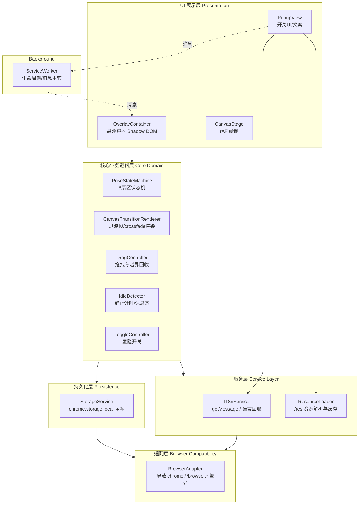
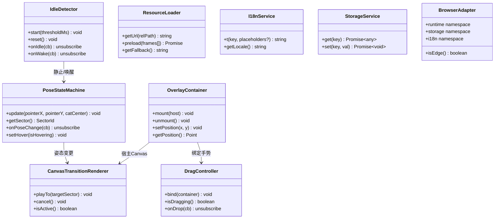
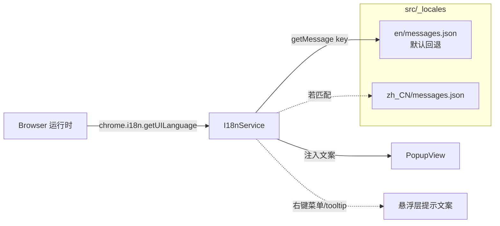
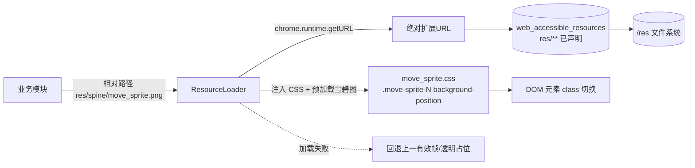
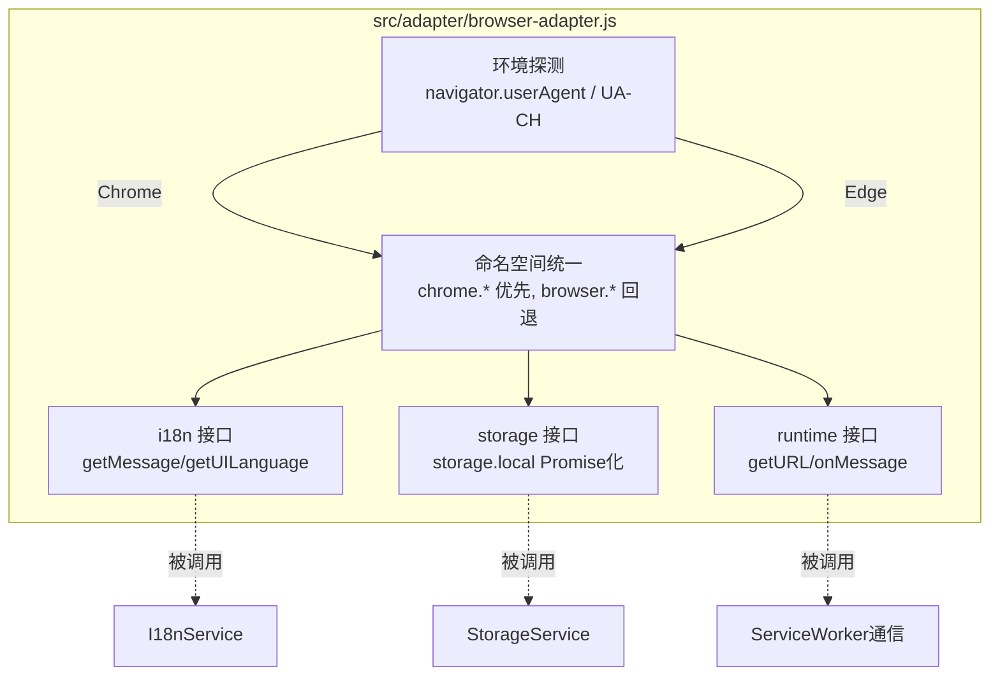
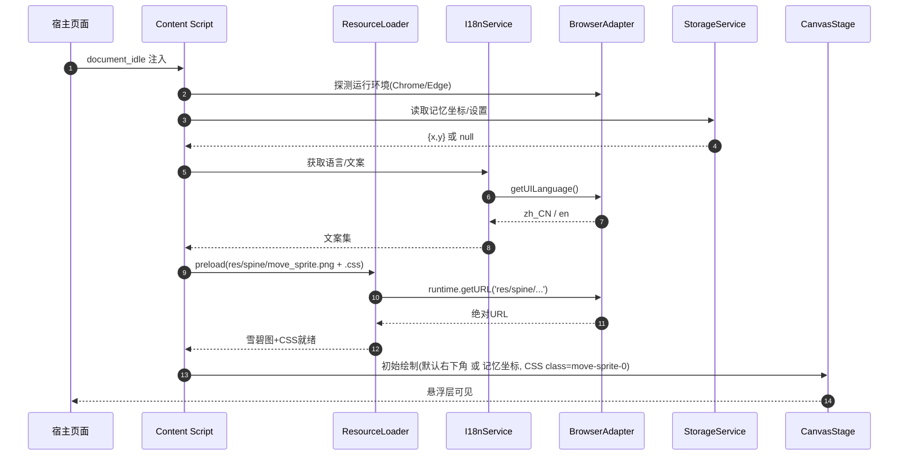
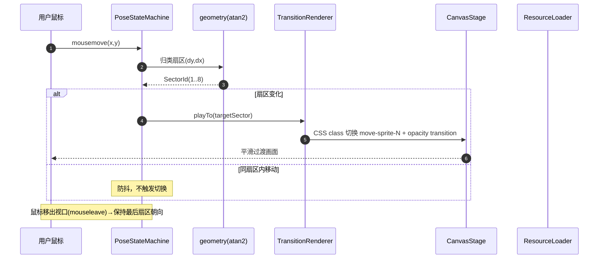
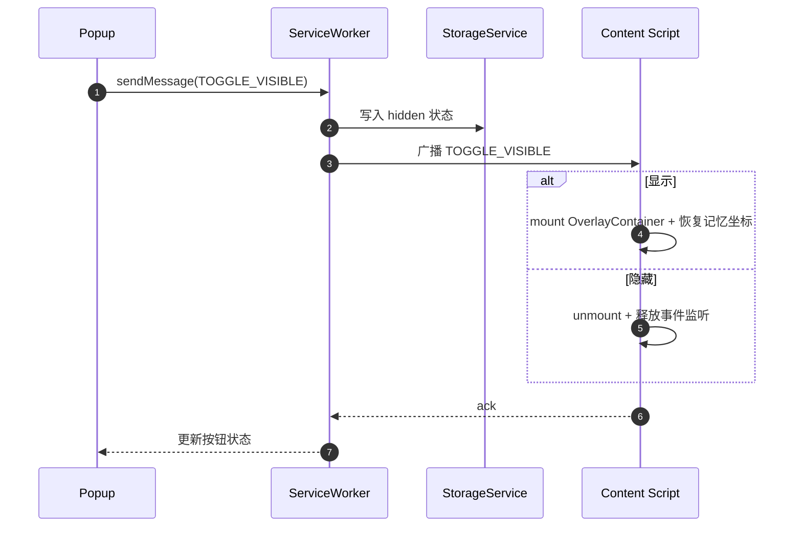
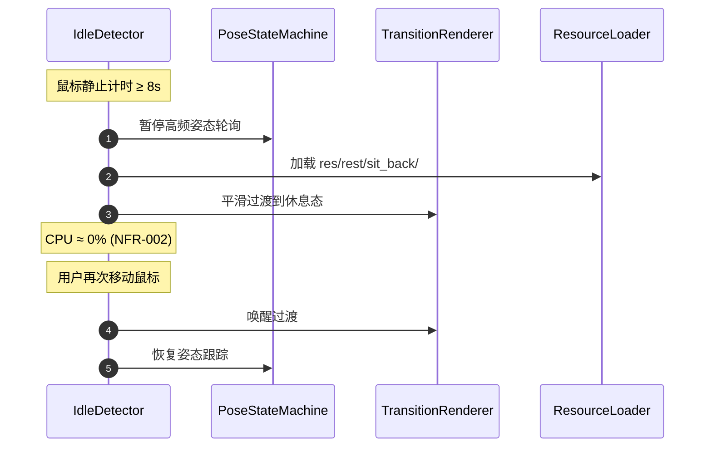
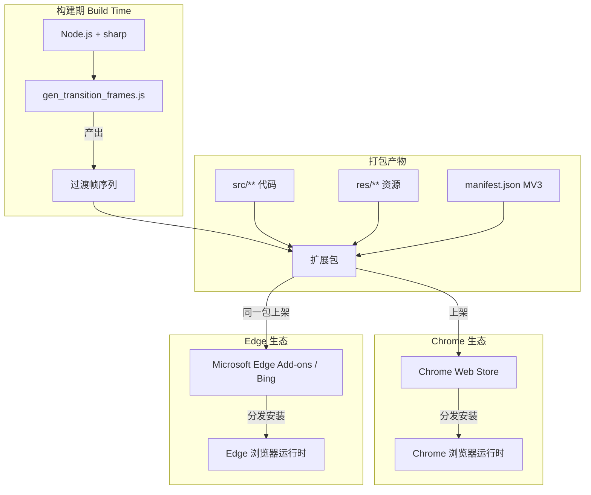

# Target File Path: /doc/1.software_architecture_document.md

> 本文件由 `generate-software-architecture-design` Skill 生成，遵循 IEEE 1471 / 4+1 视图模型，深度整合 WebExtension i18n (`/src/_locales`)、静态资源解耦 (`/res`) 与 Chrome/Edge (Bing) 双端适配架构。

---

# Cat Eyeing Mouse — 软件架构设计书 (SAD)

## 0. 文档信息

| 项 | 内容 |
|----|------|
| 项目 | Cat Eyeing Mouse 浏览器扩展 |
| 版本 | V1.0.0 |
| 基线需求 | `/doc/0.requirements_document.md` V1.0.0 |
| 架构方法 | IEEE 1471 + 4+1 视图模型 (Scenario / Logical / Development / Process / Physical) |
| 建模语言 | Mermaid UML |
| 目标平台 | Google Chrome (Manifest V3) / Microsoft Edge (Bing Add-ons, MV3) |
| 运行时依赖 | 纯前端，无后端/云端（遵循需求 §NFR-004 零网络约束） |

---

## 1. 场景视图 (Scenario View)

### 1.1 参与者识别

| 参与者 | 类型 | 职责 |
|--------|------|------|
| 终端用户 (End User) | 主动 | 拖拽猫咪、切换显隐、与网页正常交互 |
| Chrome 运行时 | 外部 | 加载 MV3 扩展、提供 `chrome.*` API |
| Edge 运行时 | 外部 | 加载 MV3 扩展、兼容 `chrome.*` 命名空间 |
| Background Service Worker | 内部系统 | 生命周期管理、存储读写、消息中转、空闲计时（必要时） |
| Content Script 运行时 | 内部系统 | 注入悬浮层、监听鼠标、渲染 Canvas |
| Popup 视图 | 内部系统 | 提供显隐开关与设置入口 |

### 1.2 核心用例图

```mermaid
flowchart LR
    User((终端用户))

    subgraph CatEyeingMouse [Cat Eyeing Mouse 扩展]
        UC1[UC-01 自动悬浮<br/>右下角显示]
        UC2[UC-02 拖拽停靠<br/>位置持久化]
        UC3[UC-03 八方向姿态跟踪<br/>实时响应鼠标]
        UC4[UC-04 姿态平滑过渡<br/>Canvas动画]
        UC5[UC-05 进入/唤醒休息态]
        UC6[UC-06 一键显隐]
        UC7[UC-07 双语 UI 自动适配]
    end

    subgraph Runtime [浏览器运行时]
        RT1[Chrome Runtime MV3]
        RT2[Edge Runtime MV3]
    end

    User -->|浏览网页| UC1
    User -->|按住拖动| UC2
    User -->|移动鼠标| UC3
    UC3 -.触发.-> UC4
    UC3 -.静止超时.-> UC5
    User -->|点击 Popup| UC6
    Runtime -.加载/语言探测.-> UC7

    RT1 -.提供 chrome.* API.-> CatEyeingMouse
    RT2 -.提供 chrome.* API.-> CatEyeingMouse
```

### 1.3 关键场景描述

| 场景 | 主流程 | 约束映射 |
|------|--------|----------|
| SC-01 初始显示 | 页面加载 → Content Script 注入悬浮层 → 读取记忆坐标(无则默认右下角) → 加载中心帧 `0.png` | FR-001 / FR-002 |
| SC-02 鼠标移动跟踪 | `mousemove` → 计算 `atan2(dy,dx)` → 归类 8 扇区 → 命中变化 → Canvas 过渡播放对应帧 | FR-003 / FR-004 / NFR-001 |
| SC-03 拖拽停靠 | 按下 → 进入拖拽态(暂停跟踪) → 跟随移动 → 松手 → 写入 `storage.local` | FR-002 |
| SC-04 hover 中心态 | 鼠标进入猫咪区域 → 立即切 `0.png`；离开 → 回方向帧 | FR-003 AC3 |
| SC-05 空闲休息 | 鼠标静止 ≥ 8s → 进入休息态加载 `res/rest/sit_back/` → 移动时平滑唤醒 | FR-008 / NFR-002 |
| SC-06 显隐切换 | Popup 点击 → 消息经 SW 中转 → Content Script 挂载/卸载悬浮层 | FR-009 |
| SC-07 语言适配 | 浏览器语言变化 → `chrome.i18n.getUILanguage()` → 加载对应 `_locales` → 刷新文案 | FR-005 |

---

## 2. 逻辑视图 (Logical View)

### 2.1 分层架构总览



### 2.2 模块职责与需求映射

| 模块 | 所属层 | 职责 | 映射需求 |
|------|--------|------|----------|
| OverlayContainer | L1 展示 | 注入独立 Shadow DOM 悬浮层；透明背景、高 z-index、pointer-events 策略；默认右下角贴边 | FR-001 |
| CanvasStage | L1 展示 | CSS Sprite 宿主元素管理（`background-position` 帧切换）；Canvas 2D 过渡备选；页面隐藏时暂停 | FR-003 / FR-004 / NFR-007 |
| PopupView | L1 展示 | Popup UI（显隐、边界约束开关）；文案走 i18n；图标走 /res | FR-005 / FR-006 / FR-009 |
| PoseStateMachine | L2 核心 | 监听 `mousemove`/`mouseleave`；`atan2` 计算并归类 8 扇区 + 中心态；**鼠标移出视口时保持最后方向**；输出姿态变更事件；防抖 | FR-003 |
| CanvasTransitionRenderer | L2 核心 | CSS class 切换 + opacity transition 淡入淡出；Canvas crossfade 备选；抢占/合并策略；最小过渡间隔节流 | FR-004 |
| DragController | L2 核心 | 按下/移动/松手手势；禁用文本选中与滚动；越界回收 | FR-002 |
| IdleDetector | L2 核心 | 静止计时（默认 8s）；进入/唤醒休息态；静止时降级轮询 | FR-008 / NFR-002 |
| ToggleController | L2 核心 | 显隐状态管理；显隐时挂载/卸载监听 | FR-009 |
| I18nService | L3 服务 | `chrome.i18n.getMessage` 封装；`getUILanguage` 探测；en 回退 | FR-005 |
| ResourceLoader | L3 服务 | `chrome.runtime.getURL('res/...')` 解析；预加载/缓存；失败回退 | FR-006 |
| StorageService | L4 持久化 | 封装 `chrome.storage.local`；坐标/设置读写；Promise 化 | FR-002 / FR-009 |
| BrowserAdapter | L5 适配 | 统一 `chrome.*`/`browser.*` 调用；运行环境探测；API 差异屏蔽 | FR-007 |
| ServiceWorker | Background | 安装/激活；消息中转（Popup↔Content）；可选的空闲/通知策略 | FR-007 / FR-009 |

### 2.3 模块间高层接口契约（API 签名）

> 仅定义接口形态，不含实现代码。



**关键数据结构：**

| 类型 | 字段 | 说明 |
|------|------|------|
| `SectorId` | `0..8` | 0=中心(hover)；1=右上；2=右；3=右下；4=下；5=左下；6=左；7=左上；8=上 |
| `Point` | `{x:number, y:number}` | 视口坐标 |
| `PoseFrame` | `{sector:SectorId, url:string}` | 单帧资源 |
| `Settings` | `{hidden:boolean, clampToViewport:boolean, locale?:string}` | 持久化设置 |

---

## 3. 开发视图 (Development View)

### 3.1 技术选型与架构决策

| 决策点 | 选择 | 理由 |
|--------|------|------|
| 扩展规范 | **Manifest V3** | FR-007/NFR-006 强制；Chrome/Edge 双端审核合规；Service Worker 取代 Background Page |
| 运行时框架 | **原生 JS + DOM + CSS Sprite** | NFR-003 包体积 ≤ 2MB；NFR-008 零配置；无需重型框架 |
| 隔离方案 | **Shadow DOM**（首选）/ 独立 iframe（备选） | FR-001/NFR-009 不污染宿主页面样式与 DOM |
| 渲染技术 | **CSS Sprite（`background-position`）+ Canvas 2D（过渡备选）** | FR-003/004 帧切换 + 过渡；雪碧图减少 HTTP 请求 |
| 过渡策略 | **CSS transition + opacity 淡入淡出**（主）/ Canvas crossfade（备） | FR-004 平滑过渡；雪碧图帧间 CSS 切换 |
| 存储 | **chrome.storage.local** | FR-002 坐标/设置持久化；MV3 原生支持 |
| i18n | **WebExtension i18n (`_locales`)** | FR-005 标准规范；双端原生支持 |
| 浏览器适配 | **BrowserAdapter 抽象层** | FR-007 屏蔽 chrome.*/browser.* 差异 |
| 构建期工具 | **Node.js + sharp** | 仅用于离线生成过渡帧，不进入运行时 |

### 3.2 项目工程目录结构

```
cat_eyeing_mouse/
├── manifest.json                          # ★ MV3 清单（Chrome/Edge 共用）
├── doc/                                   # 设计文档
│   ├── 0.requirements_document.md
│   ├── 1.software_architecture_document.md
│   ├── 2.detailed_design_specification.md
│   └── 3.detailed_test_cases.md
├── src/
│   ├── _locales/                          # ★ i18n 语言包（WebExtension 标准）
│   │   ├── en/
│   │   │   └── messages.json
│   │   └── zh_CN/
│   │       └── messages.json
│   ├── content/                           # Content Script（悬浮层主逻辑）
│   │   ├── overlay-container.js           #   悬浮容器 Shadow DOM 注入
│   │   ├── pose-state-machine.js          #   8 扇区姿态状态机
│   │   ├── canvas-stage.js                #   Canvas rAF 绘制入口
│   │   ├── transition-renderer.js         #   过渡帧序列/crossfade 渲染
│   │   ├── drag-controller.js             #   拖拽手势
│   │   ├── idle-detector.js               #   空闲/休息态
│   │   └── content-main.js                #   入口：装配各模块
│   ├── background/
│   │   └── service-worker.js              #   Service Worker 生命周期/消息中转
│   ├── popup/                             # Popup UI
│   │   ├── popup.html
│   │   ├── popup.css
│   │   └── popup.js                       #   显隐/边界开关、i18n 绑定
│   ├── shared/                            # 跨上下文共享纯逻辑
│   │   ├── geometry.js                    #   atan2 扇区归类（纯函数，可测）
│   │   └── constants.js                   #   扇区角度/帧映射常量
│   └── adapter/                           # ★ 浏览器适配层
│       └── browser-adapter.js             #   BrowserAdapter
├── res/                                   # ★ 所有静态资源集中目录
│   ├── spine/                             #   雪碧图（运行时主素材）
│   │   ├── move_sprite.png                #   3×3 网格 9 帧合并 (384×384px)
│   │   ├── move_sprite.css                #   帧定位 .move-sprite-N + 动画定义
│   │   └── README.md                      #   雪碧图使用说明
│   ├── move/                              #   雪碧图源帧（仅用于重新生成）
│   │   └── 0.png ~ 8.png
│   ├── rest/
│   │   └── sit_back/
│   │       └── sit_back.png               #   休息态素材
│   └── icons/
│       ├── icon16.png
│       ├── icon48.png
│       └── icon128.png
├── tools/                                 # 构建期离线脚本（不入运行时）
│   └── gen_transition_frames.js           #   基于 sharp 生成过渡帧
└── package.json                           # sharp 仅 devDependency
```

### 3.3 i18n 模块架构与加载机制



**加载机制要点：**
1. `manifest.json` 设置 `"default_locale": "en"`（回退基线）。
2. 运行时由 `chrome.i18n.getUILanguage()` 探测首选语言，命中 `zh_CN` 则加载中文，否则回退 `en`。
3. 所有 UI 文案经 `I18nService.t(key)` 读取，**严禁硬编码**（NFR-010）。
4. message key 统一 `snake_case`，每项含 `message` + `description` 字段。

**messages.json 结构契约（高层，非实现）：**

| key 用途 | 示例 key | 说明 |
|----------|----------|------|
| Popup 标题 | `app_name` | 扩展名 |
| 显隐开关 | `action_show` / `action_hide` | 切换按钮 |
| 边界约束 | `action_clamp_viewport` | 开关项 |
| 拖拽提示 | `tip_drag_to_move` | tooltip |
| 休息态 | `status_resting` | 状态文案 |

### 3.4 静态资源 (`/res`) 加载桥接模式



**资源加载规范：**
1. 所有素材引用必须经 `ResourceLoader.getUrl('res/spine/move_sprite.png')` 转换为扩展绝对 URL（FR-006 AC1）。
2. `manifest.json` 的 `web_accessible_resources` 以最小化原则声明 `res/**`，避免 CSP/CORS 阻断（FR-007 AC3）。
3. **雪碧图加载流程：** ResourceLoader 启动时注入 `move_sprite.css`（`<link>` 到 Shadow DOM），并预加载 `move_sprite.png`（`new Image()` 预热浏览器缓存），避免切换时闪烁。
4. 加载失败回退上一有效帧或透明占位，记录 `console.warn`，不抛未捕获异常（FR-006 AC2）。

### 3.5 跨浏览器兼容适配层 (BrowserAdapter)



**适配策略：**
1. **命名空间统一：** Edge (Chromium 内核) 与 Chrome 均暴露 `chrome.*`，BrowserAdapter 优先取 `chrome`，回退 `browser`（为未来 Firefox 预留）。
2. **API 差异屏蔽：** 将回调式 API Promise 化，统一上层调用形态。
3. **Manifest 兼容：** 双端共用同一份 `manifest.json`（MV3），无需分叉；图标三尺寸齐备满足双端审核。
4. **权限最小化：** 仅声明 `storage`（及必要的 `scripting`），双端审核无过度声明警告（NFR-005）。

---

## 4. 进程视图 (Process View)

### 4.1 Manifest V3 运行时进程模型

| 运行上下文 | 生命周期 | 职责 | 对应模块 |
|------------|----------|------|----------|
| Content Script（页面级） | 随页面加载/卸载 | 悬浮层注入、鼠标监听、Canvas 渲染 | OverlayContainer / PoseStateMachine / CanvasStage 等 |
| Background Service Worker | 按需唤醒，空闲休眠（MV3 无状态） | 消息中转、设置读写、安装事件 | ServiceWorker / StorageService |
| Popup（按需弹出） | 用户点击图标时创建，关闭即销毁 | 显隐开关、设置 | PopupView |

> 关键约束：MV3 Service Worker **无状态、会被休眠**，所有持久状态必须落 `chrome.storage.local`，不得依赖内存态（NFR 兼容性关键决策）。

### 4.2 序列图 A：插件初始化与 i18n/资源渲染



### 4.3 序列图 B：鼠标移动 → 姿态切换 → 过渡渲染



### 4.4 序列图 C：Popup 显隐切换（经 Service Worker 中转）



### 4.5 序列图 D：空闲 → 休息态 → 唤醒



### 4.6 页面可见性与性能控制

| 事件 | 行为 | 目的 |
|------|------|------|
| `visibilitychange` → hidden | 暂停 `requestAnimationFrame` 与 mousemove 轮询 | NFR-002 省 CPU |
| `visibilitychange` → visible | 恢复渲染循环与监听 | 正常工作 |
| 高刷新率屏 (120/144Hz) | 渲染跟随刷新率，姿态切换逻辑保持时间驱动 | NFR-001 防过度刷新 |

---

## 5. 物理视图 (Physical View)

### 5.1 部署架构图



### 5.2 物理部署单元

| 单元 | 内容 | 说明 |
|------|------|------|
| 扩展包 (Extension ZIP) | `manifest.json` + `src/**` + `res/**` | 同一包同时上架 Chrome/Edge（MV3 兼容） |
| 静态资源包 | `res/spine/**` + `res/move/**` + `res/rest/**` + `res/icons/**` | 随扩展分发，运行时无外链（NFR-004） |
| 过渡帧产物 | `res/move/transitions/**`（可选） | Canvas 模式时构建期生成，打入扩展包 |
| 本地运行环境 | 用户浏览器 | Chrome ≥ 88 / Edge ≥ 88（NFR-006） |

### 5.3 跨平台构建与发布拓扑

1. **构建（一次性）：** 雪碧图源帧 `res/move/0~8.png` → 合并生成 `res/spine/move_sprite.png`（3×3 网格）+ `move_sprite.css`。Canvas 过渡模式额外执行 `tools/gen_transition_frames.js` 生成过渡帧。
2. **打包：** 将 `manifest.json + src/ + res/` 打成 ZIP（排除 `tools/`、`node_modules/`、`doc/`）。
3. **发布双端：**
   - Chrome Web Store：上传 ZIP，声明最小权限，通过 MV3 审核。
   - Edge Add-ons：上传**同一 ZIP**，Edge 基于 Chromium 兼容 `chrome.*`，通过审核。
4. **零后端：** 全程不涉及任何服务器部署（NFR-004）。

---

## 6. 关键技术架构决策与风险分析

### 6.1 MV3 Service Worker 无状态与持久化设计

* **问题：** MV3 Service Worker 会被浏览器在空闲时休眠，内存态丢失。
* **决策：** 所有需要跨生命周期的状态（坐标、显隐、设置）必须落 `chrome.storage.local`；Service Worker 仅做无状态的消息中转与生命周期事件处理。
* **风险与对策：** Content Script 主动从 `storage.local` 读取记忆坐标，不依赖 SW 内存态，规避休眠竞态。

### 6.2 双浏览器打包发布与审核合规差异

* **问题：** Chrome 与 Edge 审核规则存在细节差异。
* **决策：** 采用单一 MV3 manifest + `chrome.*` 命名空间；权限最小化（仅 `storage`/`scripting`）；图标三尺寸齐备；`web_accessible_resources` 显式声明 `res/**`。
* **风险与对策：** 避免使用双端不兼容的私有 API；上线前分别在两商店做沙盒审核校验，确保无 manifest 警告（FR-007 AC4）。

### 6.3 i18n 回退 (Fallback) 与动态更新机制

* **问题：** 缺失语言包或 key 时如何兜底。
* **决策：**
  - `default_locale: en` 为回退基线。
  - `chrome.i18n.getMessage(key)` 在缺失 key 时返回 `""`；`I18nService.t()` 在此基础上回退到 key 名称或占位符。
  - 新增功能必须同步补齐 `zh_CN` 与 `en`（NFR-010）。
* **动态更新：** 切换浏览器语言后刷新页面即生效，无需扩展更新。

### 6.4 静态资源 (`/res`) 安全加载机制

* **问题：** Content Script 注入的图片需可被宿主页面访问，否则被 CSP/CORS 阻断。
* **决策：**
  - `manifest.json` 的 `web_accessible_resources` 声明：
    - `resources: ["res/**"]`
    - `matches: ["<all_urls>"]`（最小化原则下可按需求收紧）
  - 资源 URL 一律经 `chrome.runtime.getURL()` 解析。
  - 加载失败回退上一有效帧/透明占位（FR-006 AC2）。
* **风险与对策：** 滥用 `<all_urls>` 可能触发审核警告；发布前评估是否可收紧 matches。

### 6.5 宿主页面隔离（Shadow DOM）

* **问题：** 悬浮层注入可能污染宿主样式/DOM。
* **决策：** 采用 Shadow DOM 封装悬浮容器，样式与 DOM 与宿主完全隔离；不得修改 `document.body` 已有节点。
* **风险与对策：** Shadow DOM 内事件需正确委托；pointer-events 策略确保仅猫图像区域响应、其余透传（FR-001 AC3）。

### 6.6 性能与节流策略

* **问题：** `mousemove` 高频触发可能导致过渡堆栈卡顿。
* **决策：**
  - PoseStateMachine 对同扇区内移动做防抖（不触发切换）。
  - TransitionRenderer 具备抢占/合并策略，新过渡到来时取消旧过渡。
  - 设置最小过渡间隔（如 60ms 节流）。
  - 页面隐藏时暂停 rAF（NFR-002）。
* **风险与对策：** 快速画圈场景下可能跳过中间帧；通过过渡合并保证最终态正确，视觉上可接受。

---

## 7. 需求覆盖矩阵 (Requirement Traceability Matrix)

### 7.1 功能需求覆盖表

| 需求编号 | 功能 | 对应逻辑组件/模块 | 视图落点 |
|----------|------|-------------------|----------|
| FR-001 | 悬浮容器与默认停靠 | OverlayContainer | 逻辑 §2.2 / 开发 §3.2 / 进程 §4.1 |
| FR-002 | 可拖拽停靠 + 持久化 | DragController + StorageService | 逻辑 §2.2 / 进程 §4.2 |
| FR-003 | 八方向+中心态姿态切换 | PoseStateMachine + shared/geometry | 逻辑 §2.2-2.3 / 进程 §4.3 |
| FR-004 | Canvas 姿态过渡动画 | CanvasTransitionRenderer + CanvasStage | 逻辑 §2.2 / 开发 §3.1 / 进程 §4.3 |
| FR-005 | i18n 双语架构 | I18nService + `/src/_locales` | 开发 §3.3 / 进程 §4.2 |
| FR-006 | `/res` 静态资源解耦 | ResourceLoader + `/res` 目录 | 开发 §3.4 / 物理 §5.2 |
| FR-007 | Chrome & Edge 双端适配 | BrowserAdapter + manifest.json(MV3) | 开发 §3.5 / 物理 §5.3 |
| FR-008 | 休息态 Idle/Rest | IdleDetector | 逻辑 §2.2 / 进程 §4.5 |
| FR-009 | 开关与置顶 | ToggleController + PopupView | 逻辑 §2.2 / 进程 §4.4 |

### 7.2 非功能需求覆盖表

| 需求编号 | 类别 | 需求 | 架构技术对策 | 落点 |
|----------|------|------|--------------|------|
| NFR-001 | 性能 | 切换延迟 ≤ 50ms | PoseStateMachine 防抖 + 预加载帧 + rAF 直绘 | §4.3 / §6.6 |
| NFR-002 | 性能 | 空闲 CPU ≈ 0% | IdleDetector 降级轮询 + visibilitychange 暂停 rAF | §4.5-4.6 |
| NFR-003 | 性能 | 包体积 ≤ 2MB | 原生 JS 无框架；过渡帧为 PNG 序列；排除 tools/doc | §3.1 / §5.3 |
| NFR-004 | 安全/隐私 | 零网络零上报 | 无 fetch/XHR；资源全部本地 /res；无后端拓扑 | §5 / §6.4 |
| NFR-005 | 安全/隐私 | 最小权限 | manifest 仅声明 storage/scripting | §3.5 / §6.2 |
| NFR-006 | 兼容性 | Chrome/Edge ≥ 88 | MV3 标准命名空间统一 | §3.5 / §5.1 |
| NFR-007 | 兼容性 | 高分屏不糊 | CanvasStage devicePixelRatio 缩放 | §3.1 / §2.2 |
| NFR-008 | 可用性 | 零配置 | 默认右下角；无依赖项 | §1.3 SC-01 |
| NFR-009 | 健壮性 | 特殊页面容错 | Content Script 注入失败静默跳过；Shadow DOM 隔离 | §6.5 |
| NFR-010 | 可维护性 | i18n 100% 覆盖 | I18nService 统一出口；硬编码禁令 | §3.3 / §6.3 |

---

## 8. 附录：边界情况架构对策（对齐需求 §6）

| 边界情况 | 架构对策 |
|----------|----------|
| 鼠标快速画圈/抖动 | TransitionRenderer 抢占/合并 + 60ms 节流 |
| 45° 扇区边界 | `shared/geometry.js` 统一右开左闭归类（纯函数可测） |
| 素材加载失败 | ResourceLoader 回退上一有效帧/透明占位 + console.warn |
| 窗口缩放/越界 | DragController 越界回收到最近有效边缘 |
| 特殊页面无法注入 | Content Script 静默跳过，不报错 |
| 多标签页/多窗口 | 每标签页独立 Content Script 实例，位置默认隔离存储 |
| visibilitychange 隐藏 | 暂停 rAF 与轮询 |
| 高刷新率屏 | 渲染随刷新率，姿态切换时间驱动 |
