# Target File Path: /doc/2.detailed_design_specification.md

> 本文件由 `generate-module-detailed-design` Skill 生成，基线为 `/doc/0.requirements_document.md` (V1.0.0) 与 `/doc/1.software_architecture_document.md` (V1.0.0)。
> 覆盖 18 个逻辑模块的接口契约、数据结构、状态机、流程、降级、日志、序列、错误处理与模块测试集，支持 AI Agent 分模块独立编程。

---

# Cat Eyeing Mouse — 模块详细设计规格说明书 (DDS)

## 0. 文档总览

### 0.1 设计基线引用

| 基线 | 文件 | 关键章节 |
|------|------|----------|
| 需求 | `0.requirements_document.md` | FR-001~009、NFR-001~010、§6 边界、§7 假设 |
| 架构 | `1.software_architecture_document.md` | §2.1 分层、§2.2 模块映射、§2.3 接口契约、§3.2 目录 |

### 0.2 模块清单（与架构 §2.2 / §3.2 一一对应）

> 注：WebExtension i18n 规范要求 `_locales/` 目录位于扩展根目录（与 `manifest.json` 同级），而非 `src/` 下。本项目遵循此规范，语言包存放于根目录 `_locales/{lang}/messages.json`。

| 编号 | 模块 | 所属层 | 文件路径 | 映射需求 | 设计章节 |
|------|------|--------|----------|----------|----------|
| M-01 | BrowserAdapter | L5 适配 | `src/adapter/browser-adapter.js` | FR-007 | §2 |
| M-02 | StorageService | L4 持久化 | `src/adapter/storage-service.js` | FR-002/009 | §3 |
| M-03 | I18nService | L3 服务 | `src/adapter/i18n-service.js`（绑定根 `/_locales`） | FR-005 | §4 |
| M-04 | ResourceLoader | L3 服务 | `src/adapter/resource-loader.js` | FR-006 | §5 |
| M-05 | shared/geometry | 共享纯逻辑 | `src/shared/geometry.js` | FR-003 | §6 |
| M-06 | shared/constants | 共享纯逻辑 | `src/shared/constants.js` | FR-003/008 | §7 |
| M-07 | PoseStateMachine | L2 核心 | `src/content/pose-state-machine.js` | FR-003 | §8 |
| M-08 | CanvasTransitionRenderer | L2 核心 | `src/content/transition-renderer.js` | FR-004 | §9 |
| M-09 | CanvasStage | L1 展示 | `src/content/canvas-stage.js` | FR-004 | §10 |
| M-10 | DragController | L2 核心 | `src/content/drag-controller.js` | FR-002 | §11 |
| M-11 | IdleDetector | L2 核心 | `src/content/idle-detector.js` | FR-008 | §12 |
| M-12 | ToggleController | L2 核心 | `src/content/toggle-controller.js` | FR-009 | §13 |
| M-13 | OverlayContainer | L1 展示 | `src/content/overlay-container.js` | FR-001 | §14 |
| M-14 | PopupView | L1 展示 | `src/popup/popup.js` + `popup.html` + `popup.css` | FR-005/009 | §15 |
| M-15 | ServiceWorker | Background | `src/background/service-worker.js` | FR-007/009 | §16 |
| M-16 | shared/types | 共享纯逻辑 | `src/shared/types.js` | NFR-010 | §17 |
| M-17 | shared/logger | 共享基础设施 | `src/shared/logger.js` | NFR-010 | §18 |
| M-18 | content-main | Content 入口 | `src/content/content-main.js` | FR-001~009 | §19 |

### 0.3 设计约定

* **接口契约优先：** 所有跨模块调用必须走本文件 §20 契约矩阵中的公开接口；私有状态禁止跨模块读写。
* **依赖方向：** L1→L2→L3→L4→L5；shared（M-05/M-06/M-16/M-17）可被任意层依赖但自身不依赖任何层。M-18 content-main 作为入口装配层，依赖各层模块但通过回调桥接打破循环依赖（§19.5）。
* **错误传播：** 底层错误经 `Result<T>`（M-16）或异常向上抛出，UI 层最终负责降级呈现。
* **图表规范：** classDiagram（类型）、stateDiagram（状态机）、flowchart（算法）、sequenceDiagram（交互）。

### 0.4 构建说明

> manifest.json 的 `content_scripts.js` 指向打包产物 `dist/content.js`（IIFE 格式），**不是源码**。

| 命令 | 用途 | 说明 |
|------|------|------|
| `npm run build` | esbuild 打包 | `esbuild src/content/content-main.js --bundle --outfile=dist/content.js --format=iife --target=chrome110` |
| `npm run build:watch` | 监听模式 | 开发时自动重建 `dist/content.js` |
| `npm test` | Vitest 单测 | 运行 `src/**/__tests__/*.test.js`（jsdom 环境） |

* **运行时无打包器：** esbuild 仅为开发期依赖，扩展运行时为原生 JS ES Module + IIFE 产物。
* **Background Service Worker** 直接以 `"type": "module"` 加载 `src/background/service-worker.js`，无需打包。

---

## 1. 全局数据类型定义

> 以下类型被多模块共享，统一定义于 `src/shared/constants.js` 与 `src/shared/geometry.js`，各模块通过 import 引用。

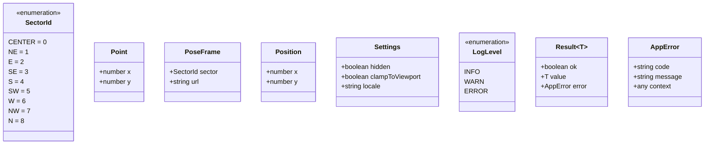

---

## 2. M-01 BrowserAdapter（跨浏览器适配层）

### 2.1 模块概览
* **职责：** 屏蔽 Chrome (`chrome.*`) 与 Edge (`browser.*`) 底层差异，向 L1~L4 提供统一的运行时/存储/i18n 命名空间，并暴露运行环境探测能力（对应架构 §2.2 L5、开发视图 §3.5）。
* **依赖关系：**
  * 上游（被依赖方）：M-02 StorageService、M-03 I18nService、M-04 ResourceLoader、M-15 ServiceWorker。
  * 下游（依赖方）：仅依赖浏览器原生 `globalThis.chrome` / `globalThis.browser`，无内部模块依赖。

### 2.2 接口契约定义

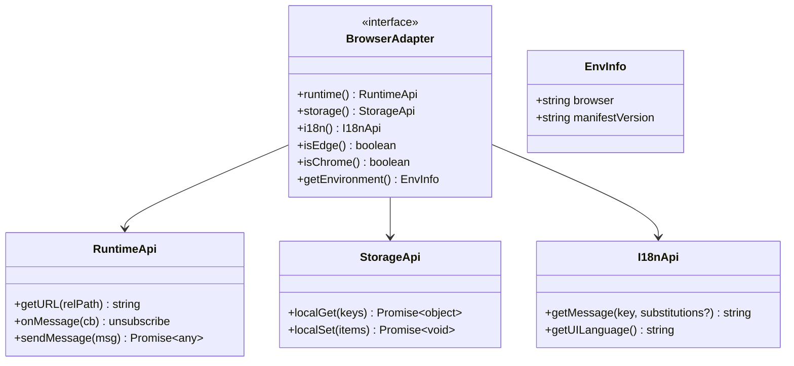

| 方法 | 签名 | 入参 | 出参 | 异常 | 幂等 |
|------|------|------|------|------|------|
| `runtime()` | `() => RuntimeApi` | 无 | 运行时 API 句柄 | 无（返回统一对象） | 是 |
| `storage()` | `() => StorageApi` | 无 | 存储 API 句柄 | 无 | 是 |
| `i18n()` | `() => I18nApi` | 无 | i18n API 句柄 | 无 | 是 |
| `isEdge()` | `() => boolean` | 无 | 是否 Edge | 无 | 是 |
| `isChrome()` | `() => boolean` | 无 | 是否 Chrome | 无 | 是 |
| `getEnvironment()` | `() => EnvInfo` | 无 | `{browser, manifestVersion}` | 无 | 是 |

**契约验证：** 消费者通过 Mock 一个返回固定 `RuntimeApi/StorageApi/I18nApi` 的对象进行单测；提供者用 jsdom + 注入 `globalThis.chrome` 桩自测。

### 2.3 数据结构与状态机
* **无状态模块：** BrowserAdapter 为纯查询型适配，不持有可变状态。
* **状态机：** 不适用（无状态）。

### 2.4 配置项

| 配置名 | 类型 | 默认值 | 说明 |
|--------|------|--------|------|
| `NAMESPACE_PREFERENCE` | `string[]` | `["chrome","browser"]` | 命名空间优先级，chrome 优先、browser 回退 |
| `SUPPORTED_ENVS` | `string[]` | `["chrome","edge"]` | 受支持运行环境白名单（NFR-006） |

### 2.5 核心逻辑流程

```mermaid
flowchart TD
    A[getAdapter] --> B{globalThis.chrome 存在?}
    B -- 是 --> C[选用 chrome.*]
    B -- 否 --> D{globalThis.browser 存在?}
    D -- 是 --> E[选用 browser.*]
    D -- 否 --> F[抛 UNSUPPORTED_ENV]
    C --> G[探测 UA / UA-CH 判定 Chrome|Edge]
    E --> G
    G --> H[返回 EnvInfo]
```

### 2.6 可靠性与优雅降级
* `chrome` 与 `browser` 均缺失 → 抛 `UNSUPPORTED_ENV`，由上层捕获决定“静默不注入”（NFR-009）。
* 单个 API 缺失（如 `getUILanguage` 不可用）→ 返回安全默认值（语言回退 `en`，详见 M-03）。

### 2.7 可观测性与日志

| 事件 | 级别 | 上下文 |
|------|------|--------|
| 环境探测完成 | INFO | `{browser, manifestVersion}` |
| 命名空间回退到 browser.* | WARN | `{reason:"chrome_missing"}` |
| 不受支持环境 | ERROR | `{code:"UNSUPPORTED_ENV"}` |

### 2.8 模块间交互序列

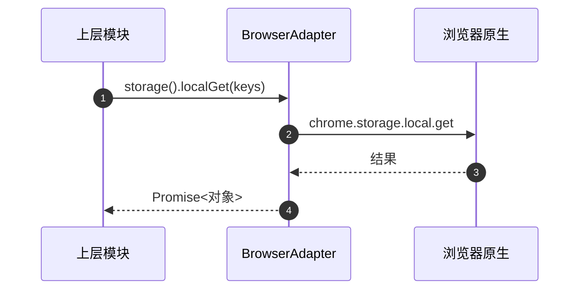

### 2.9 错误处理

| 错误代码 | 含义 | 恢复机制 | 上抛策略 |
|----------|------|----------|----------|
| `UNSUPPORTED_ENV` | 无 chrome/browser 命名空间 | 上层捕获→不注入 | 向上抛 AppError |
| `API_MISSING` | 个别 API 缺失 | 返回安全默认值 | 记 WARN，不抛 |

### 2.10 模块测试集（`src/adapter/__tests__/browser-adapter.test.js`）
* **正向：** 注入 `chrome` 桩 → `isChrome()` 为真、`runtime()` 返回有效句柄。
* **正向：** 注入 `browser` 桩（无 chrome）→ 回退成功。
* **异常：** 两者皆空 → 抛 `UNSUPPORTED_ENV`。
* **边界：** 仅 `storage` 缺失 `getUILanguage` → 返回默认值不抛。

---

## 3. M-02 StorageService（持久化层）

### 3.1 模块概览
* **职责：** 对 `chrome.storage.local` 进行 Promise 化封装，提供坐标、设置、显隐状态的读写（架构 §2.2 L4、FR-002 AC3 / FR-009）。
* **依赖：** 上游被 M-07/M-10/M-12/M-13 依赖；下游依赖 M-01 BrowserAdapter。

### 3.2 接口契约定义

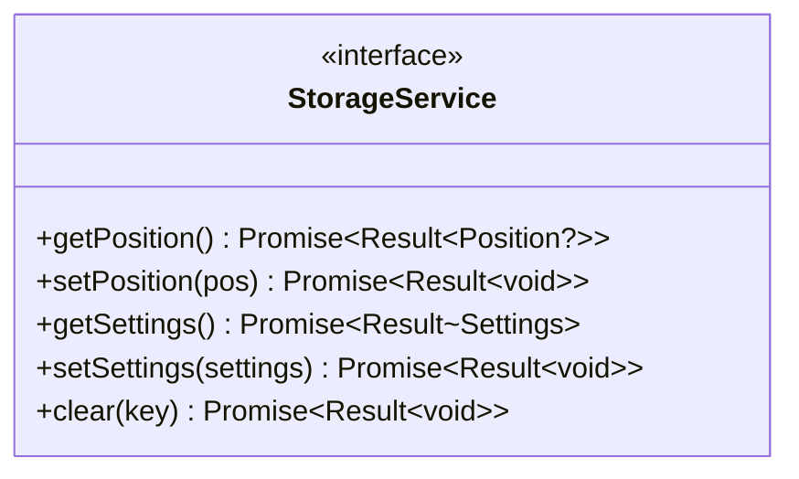

| 方法 | 签名 | 入参 | 出参 | 异常 | 幂等 |
|------|------|------|------|------|------|
| `getPosition()` | `() => Promise<Result<Position?>>` | 无 | 记忆坐标或 null | 不抛（包于 Result） | 是 |
| `setPosition(pos)` | `(pos:Point) => Promise<Result<void>>` | `{x,y}` | ok/err | 不抛 | 是（覆盖写） |
| `getSettings()` | `() => Promise<Result<Settings>>` | 无 | 设置对象（缺省合并默认） | 不抛 | 是 |
| `setSettings(s)` | `(s:Partial<Settings>) => Promise<Result<void>>` | 部分设置 | ok/err | 不抛 | 是 |

**契约验证：** 消费者 Mock `StorageService` 返回固定 `Result.ok(...)`；提供者用 `chrome.storage.local` 桩自测。

### 3.3 数据结构与状态机
* 无状态模块（每次读写都经 M-01 直达存储）。
* 数据结构见 §1 `Position` / `Settings`。

### 3.4 配置项

| 配置名 | 类型 | 默认值 | 说明 |
|--------|------|--------|------|
| `KEY_POSITION` | `string` | `"cem.position"` | 坐标存储键 |
| `KEY_SETTINGS` | `string` | `"cem.settings"` | 设置存储键 |
| `DEFAULT_SETTINGS` | `Settings` | `{hidden:false, clampToViewport:true, locale:"en"}` | 默认设置 |
| `DEFAULT_POSITION` | `Position` | `null`（由调用方决定右下角计算） | 无记忆坐标时的语义 |

### 3.5 核心逻辑流程

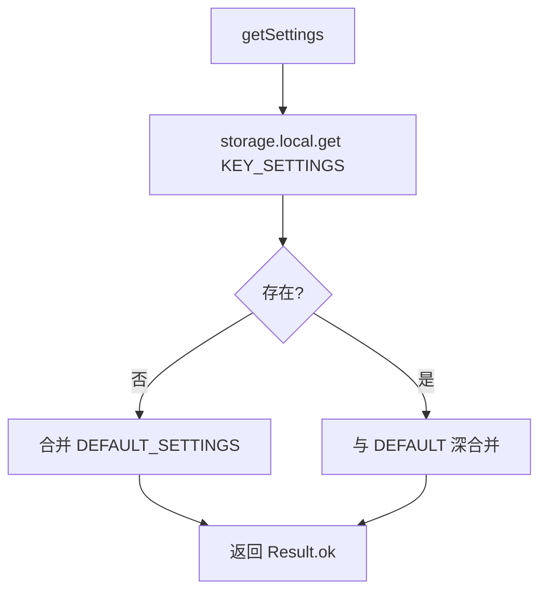

### 3.6 可靠性与优雅降级
* `storage.local` 不可用（受限页面）→ `Result.err({code:"STORAGE_UNAVAILABLE"})`，上层使用内存默认值。
* 读取值结构损坏 → 深合并默认值，记录 WARN。

### 3.7 可观测性与日志

| 事件 | 级别 | 上下文 |
|------|------|--------|
| 坐标持久化 | INFO | `{x,y}` |
| 设置结构损坏被合并 | WARN | `{rawKeys}` |
| 存储不可用 | ERROR | `{code:"STORAGE_UNAVAILABLE"}` |

### 3.8 模块间交互序列

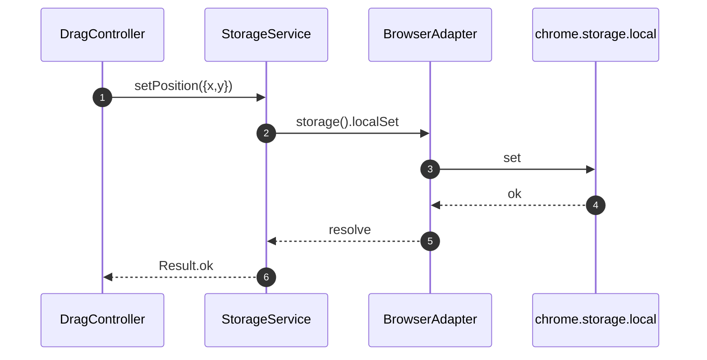

### 3.9 错误处理

| 错误代码 | 含义 | 恢复 | 上抛 |
|----------|------|------|------|
| `STORAGE_UNAVAILABLE` | storage API 不可用 | 调用方用内存默认值 | Result.err，不抛 |
| `STORAGE_QUOTA` | 写入超限 | 记 ERROR，调用方提示 | Result.err |

### 3.10 模块测试集（`src/adapter/__tests__/storage-service.test.js`）
* 正向：写入坐标后读取一致。
* 正向：`getSettings` 缺省返回 `DEFAULT_SETTINGS`。
* 边界：部分设置写入→深合并保持其它字段。
* 异常：storage 抛错→返回 `STORAGE_UNAVAILABLE` 且不崩。

---

## 4. M-03 I18nService（国际化服务，绑定 `/src/_locales`）

### 4.1 模块概览
* **职责：** 基于 WebExtension i18n 规范，从扩展根目录 `/_locales/{lang}/messages.json` 读取文案，提供统一文本检索与占位符替换；探测 UI 语言并执行回退（架构 §3.3、FR-005）。实现文件位于 `src/adapter/i18n-service.js`，语言包目录 `/_locales/` 遵循 WebExtension 规范置于扩展根目录（与 `manifest.json` 同级，由 `default_locale` 指定回退基线）。
* **依赖：** 上游被 M-14 PopupView、M-13 OverlayContainer（tooltip）、M-15 ServiceWorker（右键菜单）依赖；下游依赖 M-01 BrowserAdapter。

### 4.2 接口契约定义

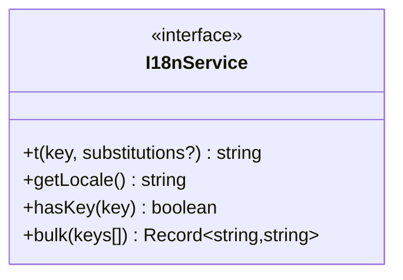

| 方法 | 签名 | 入参 | 出参 | 异常 | 幂等 |
|------|------|------|------|------|------|
| `t(key, subs?)` | `(key:string, subs?:string[]) => string` | message key + 占位符 | 翻译文本（缺失时回退） | 永不抛（内部兜底） | 是 |
| `getLocale()` | `() => string` | 无 | 当前生效语言 `zh_CN`/`en` | 不抛 | 是 |
| `hasKey(key)` | `(key) => boolean` | key | 是否存在（当前语言或回退语言） | 不抛 | 是 |
| `bulk(keys)` | `(keys:string[]) => Record<string,string>` | 批量 | key→文案映射 | 不抛 | 是 |

**契约验证：** 消费者 Mock `t()` 返回固定串；提供者用注入 `_locales` 资源 + `chrome.i18n.getMessage` 桩自测。

### 4.3 数据结构与状态机

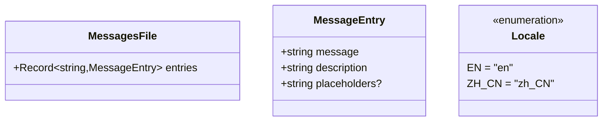

* **语言解析状态（无持久状态机）：** 解析流程为纯函数，无状态跳转。

### 4.4 配置项

| 配置名 | 类型 | 默认值 | 说明 |
|--------|------|--------|------|
| `DEFAULT_LOCALE` | `string` | `"en"` | 回退基线（与 manifest `default_locale` 一致） |
| `LOCALE_MAP` | `Record<string,string>` | `{"zh":"zh_CN","zh-CN":"zh_CN","en":"en","en-US":"en"}` | UI 语言到 _locales 目录映射 |
| `LOCALES_DIR` | `string` | `"/_locales"` | 语言包根路径（扩展根目录，WebExtension 规范要求与 manifest.json 同级；加载由原生接管） |

### 4.5 核心逻辑流程

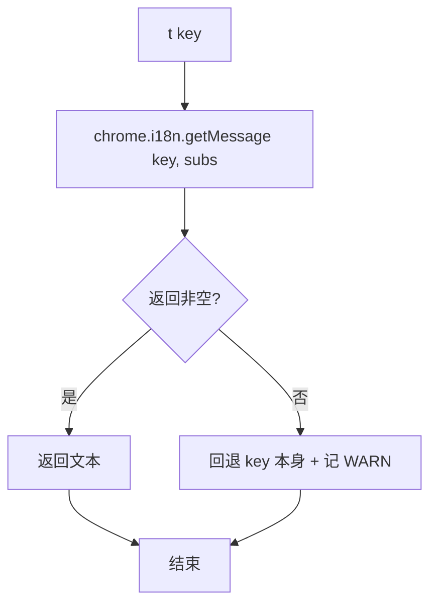

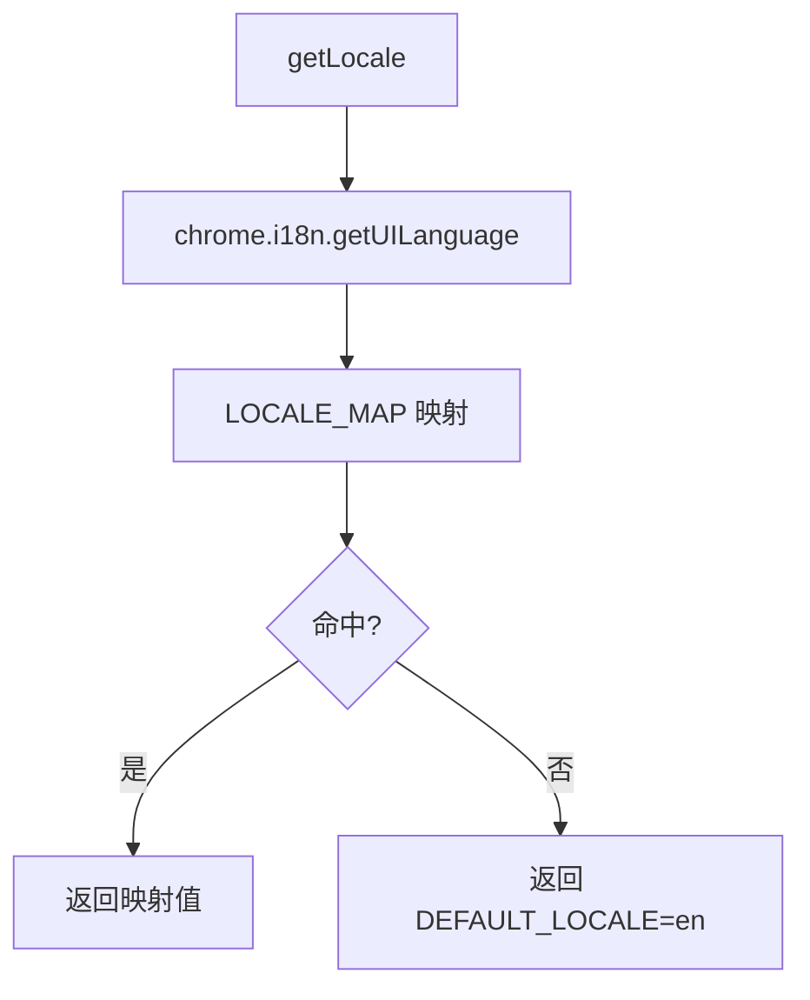

### 4.6 可靠性与优雅降级
* key 在当前语言缺失 → WebExtension 原生自动回退到 `default_locale`（`en`）。
* key 在所有语言都缺失 → `t()` 返回 `key` 本身，记 WARN，UI 不崩。
* `getUILanguage` 不可用 → 返回 `DEFAULT_LOCALE`。

### 4.7 可观测性与日志

| 事件 | 级别 | 上下文 |
|------|------|--------|
| 语言探测完成 | INFO | `{uiLang, resolved}` |
| key 缺失回退 | WARN | `{key, locale}` |
| i18n API 不可用 | ERROR | `{code:"I18N_UNAVAILABLE"}` |

### 4.8 模块间交互序列

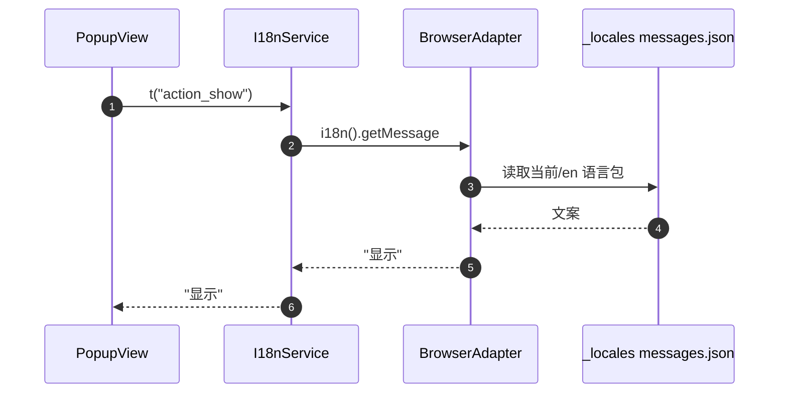

### 4.9 错误处理

| 错误代码 | 含义 | 恢复 | 上抛 |
|----------|------|------|------|
| `I18N_KEY_MISSING` | key 全部语言缺失 | 返回 key 本身 | 不抛，记 WARN |
| `I18N_UNAVAILABLE` | i18n API 缺失 | 返回 key 本身 + DEFAULT_LOCALE | 不抛，记 ERROR |

### 4.10 模块测试集（`src/adapter/__tests__/i18n-service.test.js`）
* 正向：`zh_CN` 下 `t("action_show")` 返回中文。
* 正向：`en` 回退：缺失 `zh_CN` 时返回英文。
* 异常：key 不存在→返回 key 本身并记 WARN。
* 边界：占位符替换 `$1`/`$2` 正确。

---

## 5. M-04 ResourceLoader（静态资源加载，绑定 `/res`）

### 5.1 模块概览
* **职责：** 将 `/res` 相对路径解析为扩展绝对 URL，**加载雪碧图（`res/spine/move_sprite.png` + `move_sprite.css`）并注入 Shadow DOM**，预加载图像资源并缓存；加载失败回退（架构 §3.4、FR-006）。
* **依赖：** 上游被 M-07/M-08/M-09/M-13/M-14 依赖；下游依赖 M-01 BrowserAdapter。

### 5.2 接口契约定义

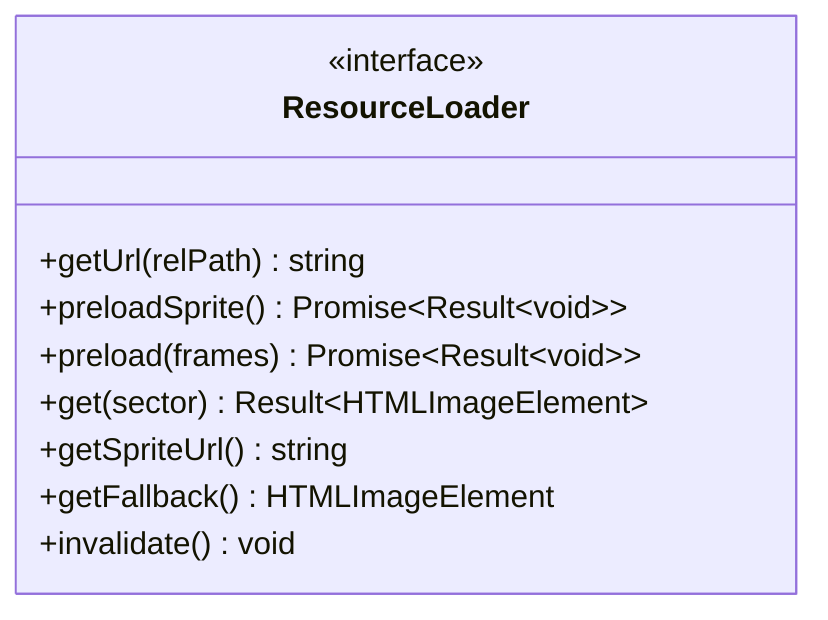

| 方法 | 签名 | 入参 | 出参 | 异常 | 幂等 |
|------|------|------|------|------|------|
| `getUrl(rel)` | `(rel:string) => string` | 如 `res/spine/move_sprite.png` | 绝对 URL | 不抛 | 是 |
| `preloadSprite()` | `() => Promise<Result<void>>` | 无 | ok/err | 不抛 | 是（重入跳过） |
| `preload(frames)` | `(frames:string[]) => Promise<Result<void>>` | 相对路径数组 | ok/err | 不抛 | 是（覆盖缓存） |
| `get(sector)` | `(sector:SectorId) => Result<HTMLImageElement>` | 扇区 id | 缓存图像 | 不抛 | 是 |
| `getSpriteUrl()` | `() => string` | 无 | 雪碧图绝对 URL | 不抛 | 是 |
| `getFallback()` | `() => HTMLImageElement` | 无 | 透明占位/SVG dataURL | 不抛 | 是 |
| `invalidate()` | `() => void` | 无 | 清缓存 | 不抛 | 是 |

**契约验证：** 消费者 Mock `get()` 返回桩 Image；提供者用 `Image` + `chrome.runtime.getURL` 桩自测。

### 5.3 数据结构与状态机

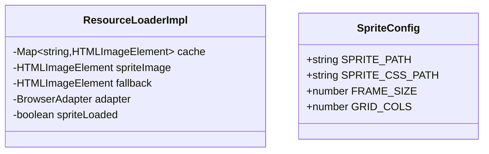

* 无显式状态机（缓存为被动填充）。

### 5.4 配置项

| 配置名 | 类型 | 默认值 | 说明 |
|--------|------|--------|------|
| `RES_ROOT` | `string` | `"res"` | 资源根目录 |
| `SPRITE_PATH` | `string` | `"res/spine/move_sprite.png"` | 雪碧图路径 |
| `SPRITE_CSS_PATH` | `string` | `"res/spine/move_sprite.css"` | 雪碧图 CSS 帧定位 |
| `SPRITE_FRAME_SIZE` | `number` | `128` | 单帧尺寸 (px) |
| `SPRITE_GRID_COLS` | `number` | `3` | 网格列数 |
| `MOVE_FRAMES` | `Record<SectorId,number>` | 见下表 | 扇区→雪碧图帧编号 |
| `REST_FRAME` | `string` | `"res/rest/sit_back/sit_back.png"` | 休息态 |
| `FALLBACK_DATAURL` | `string` | 透明 1x1 PNG | 占位 |

**MOVE_FRAMES 映射（对齐 FR-003 雪碧图契约）：**

| SectorId | 雪碧图帧编号 | CSS 类名 | 帧位置 (x, y) |
|----------|-------------|----------|---------------|
| CENTER(0) | 0 | `.move-sprite-0` | (0, 0) |
| NE(1) | 1 | `.move-sprite-1` | (128, 0) |
| E(2) | 2 | `.move-sprite-2` | (256, 0) |
| SE(3) | 3 | `.move-sprite-3` | (0, 128) |
| S(4) | 4 | `.move-sprite-4` | (128, 128) |
| SW(5) | 5 | `.move-sprite-5` | (256, 128) |
| W(6) | 6 | `.move-sprite-6` | (0, 256) |
| NW(7) | 7 | `.move-sprite-7` | (128, 256) |
| N(8) | 8 | `.move-sprite-8` | (256, 256) |

### 5.5 核心逻辑流程

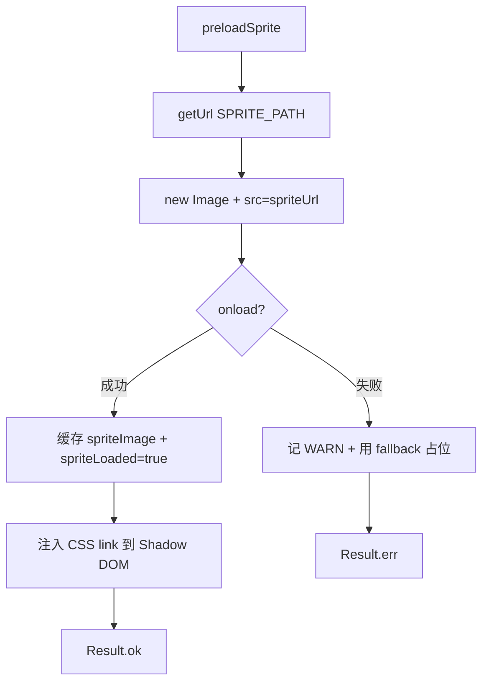

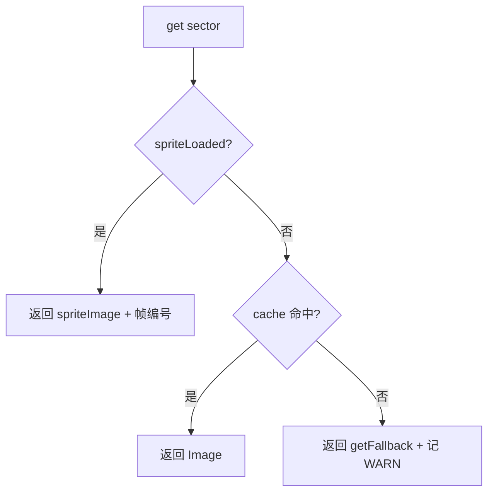

### 5.6 可靠性与优雅降级
* 加载失败 → `fallback`（透明占位），UI 不空白、不抛（FR-006 AC2）。
* `runtime.getURL` 不可用 → 返回 fallback。

### 5.7 可观测性与日志

| 事件 | 级别 | 上下文 |
|------|------|--------|
| 预加载完成 | INFO | `{count, failedCount}` |
| 单帧加载失败 | WARN | `{path, sector}` |
| getURL 不可用 | ERROR | `{code:"RES_URL_UNAVAILABLE"}` |

### 5.8 模块间交互序列

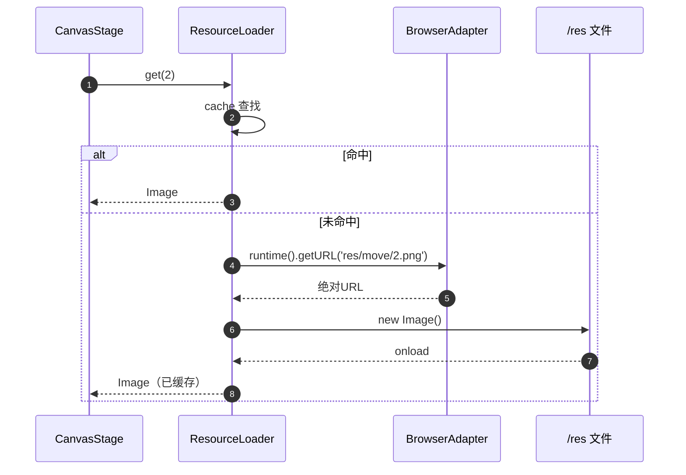

### 5.9 错误处理

| 错误代码 | 含义 | 恢复 | 上抛 |
|----------|------|------|------|
| `RES_LOAD_FAILED` | 单帧加载失败 | 用 fallback 占位 | 不抛 |
| `RES_URL_UNAVAILABLE` | getURL 不可用 | 用 fallback | 不抛，记 ERROR |

### 5.10 模块测试集（`src/adapter/__tests__/resource-loader.test.js`）
* 正向：preload 后 `get(CENTER)` 返回正确 Image。
* 边界：单帧 404 → 该 sector 返回 fallback，其它正常。
* 异常：getURL 抛 → `get` 仍返回 fallback 不崩。
* 幂等：重复 preload 不报错且覆盖缓存。

---

## 6. M-05 shared/geometry（纯函数：扇区归类）

### 6.1 模块概览
* **职责：** 提供 `atan2(dy,dx)` 纯函数计算与 8 扇区 + 中心态归类（FR-003 角度契约、架构 §3.2）。无副作用、无依赖，便于单测。

### 6.2 接口契约定义

| 方法 | 签名 | 入参 | 出参 | 幂等 |
|------|------|------|------|------|
| `computeDelta(from, to)` | `(Point,Point) => {dx,dy}` | 起点与终点 | 位移分量 | 是（纯函数） |
| `toDegrees(dx, dy)` | `(number,number) => number` | 位移分量 | `atan2(dy,dx)` 角度（度，[-180,180]） | 是 |
| `classifySector(dx, dy, hoverRadius)` | `(number,number,number) => SectorId` | 鼠标相对猫中心位移 + 中心圈半径 | SectorId | 是（纯函数） |
| `findSectorByDegree(deg)` | `(number) => SectorId` | 角度（度） | 扇区 ID（±180° 兜底为 W） | 是 |
| `angleBetween(from, to)` | `(SectorId,SectorId) => number` | 两方向 | 最短夹角度数（0~180） | 是 |

**契约验证：** 纯函数直接表驱动测试。

### 6.3 数据结构与状态机

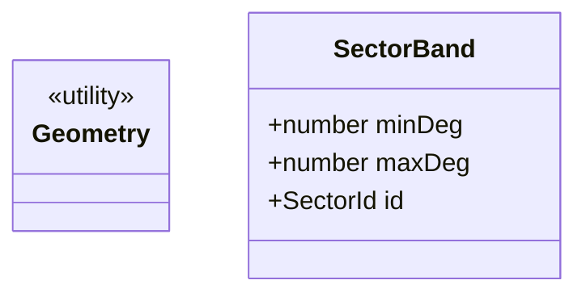

* 无状态机。

### 6.4 配置项

| 配置名 | 类型 | 默认值 | 说明 |
|--------|------|--------|------|
| `HOVER_RADIUS` | `number` | `待 M-13 传入` | 中心态判定半径（猫区域半径） |
| `BANDS` | `SectorBand[]` | 见下 | 8 扇区角度带（右开左闭） |

**BANDS（对齐 FR-003，单位度）：**
* NE(1): `[-67.5, -22.5)`
* E(2): `[-22.5, 22.5)`
* SE(3): `[22.5, 67.5)`
* S(4): `[67.5, 112.5)`
* SW(5): `[112.5, 157.5)`
* W(6): `[157.5, 180] ∪ [-180, -157.5)`
* NW(7): `[-157.5, -112.5)`
* N(8): `[-112.5, -67.5)`

### 6.5 核心逻辑流程

```mermaid
flowchart TD
    A[classifySector dx,dy,r] --> B{dist<=r ?}
    B -- 是 --> C[返回 CENTER 0]
    B -- 否 --> D[deg=atan2 dy,dx 转 度]
    D --> E[遍历 BANDS]
    E --> F{deg∈[min,max)?}
    F -- 是 --> G[返回 SectorId]
    F -- 否 --> E
```

### 6.6 可靠性与降级
* `atan2(0,0)` 返回 0 → 归为 E(2)；不抛。
* `dx,dy` 非数 → 返回 CENTER（防御）。

### 6.7 可观测性
* 纯函数无日志埋点；调用方负责记录。

### 6.8 模块间交互序列
* 无跨模块交互（被 M-07 PoseStateMachine 直接调用）。

### 6.9 错误处理
* 不抛错；非法输入返回安全默认 CENTER。

### 6.10 模块测试集（`src/shared/__tests__/geometry.test.js`）
* 正向：8 个方向中心点各归入正确 sector。
* 边界：`±22.5°`、`±67.5°` 等 → 右开左闭正确。
* 边界：`(0,0)` → CENTER；hover 内 → CENTER。
* 边界：`atan2` 跨 ±180° → W(6) 正确。

---

## 7. M-06 shared/constants（常量与帧映射）

### 7.1 模块概览
* **职责：** 集中导出全模块共享常量（SectorId 枚举、帧映射、角度带、超时、键名等），杜绝硬编码（FR-006 禁令、NFR-010）。

### 7.2 接口契约定义
* 导出常量集（非方法接口）：`SectorId`、`MOVE_FRAMES`、`ALL_MOVE_FRAMES`、`REST_FRAME`、`SPRITE_PATH`、`SPRITE_CSS_PATH`、`SPRITE_FRAME_SIZE`、`SPRITE_GRID_COLS`、`CSS_FRAME_CLASS_PREFIX`、`SECTOR_BANDS`、`KEY_POSITION`、`KEY_SETTINGS`、`DEFAULT_SETTINGS`、`DEFAULT_LOCALE`、`LOCALE_MAP`、`IDLE_THRESHOLD_MS`、`WAKE_DEBOUNCE_MS`、`TRANSITION_THROTTLE_MS`、`TRANSITION_DURATION_MS`、`RAF_SUSPEND_ON_HIDDEN`、`DPR_CAP`、`OVERLAY_Z_INDEX`、`OVERLAY_DEFAULT_EDGE_GAP_PX`、`OVERLAY_BG_TRANSPARENT`、`DRAG_MOVE_THRESHOLD_PX`、`DRAG_EDGE_MARGIN_PX`、`MSG_TYPES`。

### 7.3 数据结构

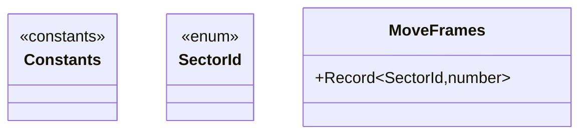

### 7.4 配置项

| 常量 | 类型 | 默认值 | 说明 |
|------|------|--------|------|
| `IDLE_THRESHOLD_MS` | `number` | `8000` | 休息态阈值（FR-008 默认 8s） |
| `WAKE_DEBOUNCE_MS` | `number` | `120` | 唤醒防抖 |
| `TRANSITION_THROTTLE_MS` | `number` | `60` | 过渡最小间隔（§6 边界节流） |
| `TRANSITION_DURATION_MS` | `number` | `120` | 单次过渡时长（80~160ms） |
| `RAF_SUSPEND_ON_HIDDEN` | `boolean` | `true` | 页面隐藏暂停 rAF（NFR-002） |
| `DPR_CAP` | `number` | `3` | devicePixelRatio 上限（NFR-007） |
| `ALL_MOVE_FRAMES` | `number[]` | `[0,1,2,3,4,5,6,7,8]` | 全部雪碧图帧编号（供 preload） |
| `SPRITE_PATH` | `string` | `"res/spine/move_sprite.png"` | 雪碧图路径 |
| `SPRITE_CSS_PATH` | `string` | `"res/spine/move_sprite.css"` | 雪碧图 CSS 帧定位 |
| `SPRITE_FRAME_SIZE` | `number` | `128` | 单帧尺寸 (px) |
| `SPRITE_GRID_COLS` | `number` | `3` | 网格列数 |
| `CSS_FRAME_CLASS_PREFIX` | `string` | `"move-sprite-"` | CSS 帧类名前缀 |
| `KEY_POSITION` | `string` | `"cem.position"` | 坐标存储键 |
| `KEY_SETTINGS` | `string` | `"cem.settings"` | 设置存储键 |
| `DEFAULT_SETTINGS` | `Settings` | `{hidden:false, clampToViewport:true, locale:"en"}` | 默认设置 |
| `DEFAULT_LOCALE` | `string` | `"en"` | 回退基线（与 manifest 一致） |
| `LOCALE_MAP` | `Record` | `{"zh":"zh_CN","zh-CN":"zh_CN",...}` | UI 语言映射 |
| `OVERLAY_Z_INDEX` | `number` | `2147483647` | 悬浮层层级 |
| `OVERLAY_DEFAULT_EDGE_GAP_PX` | `number` | `8` | 右下角贴边距离（FR-001 AC1） |
| `OVERLAY_BG_TRANSPARENT` | `boolean` | `true` | 背景透明（FR-001 AC2） |
| `DRAG_MOVE_THRESHOLD_PX` | `number` | `3` | 拖拽起始最小位移 |
| `DRAG_EDGE_MARGIN_PX` | `number` | `0` | 距视口边缘最小距离 |
| `MSG_TYPES` | `Object` | `{TOGGLE_VISIBLE,SET_CLAMP,SETTINGS_UPDATED,ACK}` | 消息协议类型白名单（M-15） |

### 7.5 核心逻辑流程
* 纯导出，无流程。

### 7.6 可靠性与降级
* 不适用。

### 7.7 可观测性
* 不适用。

### 7.8 模块间交互序列
* 无（编译期依赖）。

### 7.9 错误处理
* 无。

### 7.10 模块测试集（`src/shared/__tests__/constants.test.js`）
* 正向：`MOVE_FRAMES[CENTER]===0`（帧编号）。
* 正向：`SPRITE_PATH==="res/spine/move_sprite.png"`。
* 正向：`CSS_FRAME_CLASS_PREFIX==="move-sprite-"`。
* 正向：`IDLE_THRESHOLD_MS===8000`。
* 边界：`SECTOR_BANDS` 数量=8。

---

## 8. M-07 PoseStateMachine（8 扇区姿态状态机）

### 8.1 模块概览
* **职责：** 监听 `mousemove`，结合 hover 检测与 `classifySector` 计算当前 SectorId；命中变化时发出姿态变更事件并做防抖（FR-003、架构 §2.2 L2）。
* **依赖：** 上游被 M-08 CanvasTransitionRenderer 订阅；下游依赖 M-05 geometry、M-06 constants、M-13 OverlayContainer（提供猫中心坐标与 hover 检测回调）。

### 8.2 接口契约定义

```mermaid
classDiagram
    class PoseStateMachine {
        <<interface>>
        +update(pointer, catCenter) void
        +setHover(isHovering) void
        +current() SectorId
        +onPoseChange(cb) unsubscribe
        +onHoverChange(cb) unsubscribe
        +enterResting() void
        +exitResting() void
        +getState() PsmState
        +notifyMouseLeave(lastPoint, catCenter) void
        +notifyMouseReenter() void
    }
```

| 方法 | 签名 | 入参 | 出参 | 幂等 |
|------|------|------|------|------|
| `update(p, c)` | `(pointer:Point, catCenter:Point) => void` | 鼠标 + 猫中心 | 无（内部判定+发事件） | 是 |
| `setHover(b)` | `(boolean) => void` | 是否 hover | 无 | 是 |
| `current()` | `() => SectorId` | 无 | 当前 sector | 是 |
| `onPoseChange(cb)` | `(cb:(s:SectorId)=>void) => ()=>void` | 监听 | 取消订阅 | — |
| `onHoverChange(cb)` | `(cb:(b:boolean)=>void) => ()=>void` | 监听 | 取消订阅 | — |
| `enterResting()` | `() => void` | 无 | 无（进入休息态，忽略 update） | 是（已 Resting 则空操作） |
| `exitResting()` | `() => void` | 无 | 无（恢复 Tracking/Hover） | 是（非 Resting 则空操作） |
| `getState()` | `() => PsmState` | 无 | `"Tracking"\|"Hover"\|"Resting"` | 是 |
| `notifyMouseLeave(lastPoint, catCenter)` | `(Point, Point) => void` | 鼠标离开时的最后坐标 + 猫中心 | 无（计算最后方向扇区并保持，不重置为中心态） | 是 |
| `notifyMouseReenter()` | `() => void` | 无 | 无（恢复正常实时跟踪） | 是（非越界态则空操作） |

**契约验证：** 消费者 Mock 订阅 `onPoseChange` 断言回调 sector；提供者用纯逻辑（geometry 桩）自测。

### 8.3 数据结构与状态机

```mermaid
stateDiagram-v2
    [*] --> Tracking
    Tracking --> Hover: setHover(true)
    Hover --> Tracking: setHover(false)
    Tracking --> Resting: enterResting()（由 M-11 IdleDetector.onIdle 驱动）
    Hover --> Resting: enterResting()（由 M-11 IdleDetector.onIdle 驱动）
    Resting --> Tracking: exitResting()（由 M-11 IdleDetector.onWake 驱动，hover=false）
    Resting --> Hover: exitResting()（由 M-11 IdleDetector.onWake 驱动，hover=true）
    Resting --> [*]: 卸载
```

* **PsmState 枚举值：** `"Tracking"` | `"Hover"` | `"Resting"`（通过 `getState()` 查询）。
* **Resting 进入/退出契约：** `enterResting()` 由 M-18 content-main 在 IdleDetector `onIdle` 回调中调用；`exitResting()` 在 `onWake` 回调中调用。状态机自身不计时。
* **非法跳转拦截：** 处于 `Resting` 时忽略 `update`（除非先 `exitResting()`）；`enterResting()` 幂等（已 Resting 则空操作）。

### 8.4 配置项

| 配置名 | 类型 | 默认值 | 说明 |
|--------|------|--------|------|
| `HOVER_RADIUS` | `number` | 见 M-05 | 中心态判定半径（与猫图半径一致） |
| `DEBOUNCE_SAME_SECTOR` | `boolean` | `true` | 同 sector 连续移动不触发（FR-003 AC4） |

### 8.5 核心逻辑流程

```mermaid
flowchart TD
    A[update pointer,center] --> B{state==Resting?}
    B -- 是 --> Z[忽略]
    B -- 否 --> AA{mouseOutside?}
    AA -- 是 --> Z
    AA -- 否 --> C{hover?}
    C -- 是 --> D[目标=CENTER]
    C -- 否 --> E[classifySector dx,dy,r]
    E --> F[目标=sector]
    D --> G{目标==current?}
    F --> G
    G -- 是 --> Z
    G -- 否 --> H[更新 current + emit onPoseChange]
```

```mermaid
flowchart TD
    ML[notifyMouseLeave lastPoint,center] --> ML2{state==Resting?}
    ML2 -- 是 --> MLZ[忽略]
    ML2 -- 否 --> ML3[classifySector dx,dy,r]
    ML3 --> ML4[更新 current + emit onPoseChange]
    ML4 --> ML5[mouseOutside=true]
    MR[notifyMouseReenter] --> MR2[mouseOutside=false]
```

### 8.6 可靠性与降级
* `classifySector` 返回安全 CENTER → 状态机收敛到 CENTER，不卡死。
* 监听器抛错 → 捕获记 ERROR，不影响其它订阅者。

### 8.7 可观测性与日志

| 事件 | 级别 | 上下文 |
|------|------|--------|
| sector 变更 | INFO | `{from, to}` |
| hover 变更 | INFO | `{hover}` |
| 状态切换 Resting/Tracking | INFO | `{state}` |

### 8.8 模块间交互序列

```mermaid
sequenceDiagram
    autonumber
    participant OC as OverlayContainer
    participant PSM as PoseStateMachine
    participant G as geometry
    participant TR as TransitionRenderer
    OC->>PSM: update(pointer, catCenter)
    PSM->>G: classifySector
    G-->>PSM: sector
    PSM->>TR: emit onPoseChange(sector)
```

### 8.9 错误处理

| 错误代码 | 含义 | 恢复 | 上抛 |
|----------|------|------|------|
| `PSM_LISTENER_ERROR` | 订阅者抛错 | 捕获、继续 | 记 ERROR 不抛 |

### 8.10 模块测试集（`src/content/__tests__/pose-state-machine.test.js`）
* 正向：8 方向各触发对应 sector 回调。
* 防抖：同 sector 连续 update 仅回调一次。
* hover：进入→CENTER，离开→恢复。
* 状态机：`enterResting()` 后 `getState()==="Resting"`，`update` 被忽略。
* 状态机：`exitResting()` 后 `getState()` 恢复为 `"Tracking"` 或 `"Hover"`，`update` 恢复响应。
* 幂等：重复 `enterResting()` / `exitResting()` 不报错不副作用。
* 非法：订阅者抛错不影响后续。
* **越界跟踪：** `notifyMouseLeave(右上角点, center)` → emit NE sector + 后续 `update` 被忽略。
* **越界跟踪：** `notifyMouseReenter()` 后 → `update` 恢复实时响应。
* **越界 + Resting：** Resting 态下 `notifyMouseLeave` → 忽略（Resting 优先级高于越界）。

---

## 9. M-08 CanvasTransitionRenderer（过渡渲染）

### 9.1 模块概览
* **职责：** 接收目标 SectorId，以 **CSS class 切换 + opacity transition**（主模式）或 Canvas crossfade（备选）播放过渡；具备抢占/合并策略与最小间隔节流（FR-004）。
* **依赖：** 上游被 content-main (M-18) 装配桥接 M-07 订阅；下游依赖 M-04 ResourceLoader（雪碧图 URL）、M-06 constants、M-09 CanvasStage（Canvas 备选宿主）。

### 9.2 接口契约定义

```mermaid
classDiagram
    class CanvasTransitionRenderer {
        <<interface>>
        +playTo(target) void
        +cancel() void
        +isActive() boolean
        +onComplete(cb) unsubscribe
        +setMode(mode) void
    }
```

| 方法 | 签名 | 入参 | 出参 | 幂等 |
|------|------|------|------|------|
| `playTo(target)` | `(SectorId) => void` | 目标扇区 | 无 | 是（抢占当前） |
| `cancel()` | `() => void` | 无 | 无 | 是 |
| `isActive()` | `() => boolean` | 无 | 是否过渡中 | 是 |
| `setMode(m)` | `("frames"\|"crossfade") => void` | 模式 | 无 | 是 |
| `onComplete(cb)` | `(cb:()=>void) => ()=>void` | 监听 | 取消订阅 | — |

### 9.3 数据结构与状态机

```mermaid
stateDiagram-v2
    [*] --> Idle
    Idle --> Playing: playTo
    Playing --> Idle: 序列播完/onComplete
    Playing --> Playing: 新 playTo（抢占+合并）
    Playing --> Idle: cancel
```

### 9.4 配置项

| 配置名 | 类型 | 默认值 | 说明 |
|--------|------|--------|------|
| `MODE` | `enum` | `"css"` | `css` class 切换+transition / `crossfade` Canvas 淡入淡出 |
| `THROTTLE_MS` | `number` | `60` | 最小过渡间隔 |
| `CROSSFADE_MS` | `number` | `120` | 淡入淡出/CSS transition 时长 |
| `CSS_FRAME_CLASS_PREFIX` | `string` | `"move-sprite-"` | 雪碧图 CSS 帧类名前缀 |

### 9.5 核心逻辑流程

```mermaid
flowchart TD
    A[playTo target] --> B{now-last < THROTTLE?}
    B -- 是 --> C[合并：直接更新目标sector 记录]
    B -- 否 --> D[取消旧 rAF/timer]
    D --> E{mode?}
    E -- css --> F[切换 DOM class: move-sprite-N + opacity transition]
    E -- crossfade --> G[启动 Canvas 淡入淡出循环]
    F --> J[emit onComplete -> Idle]
    G --> H[rAF drawSprite子区域]
    H --> I{播完?}
    I -- 否 --> H
    I -- 是 --> J
```

### 9.6 可靠性与降级
* CSS mode：`transitionend` 未触发 → fallback 到 setTimeout 超时回调（`CROSSFADE_MS + 50ms`）。
* Canvas crossfade 失败 → 直接切换 CSS class（接受硬切，记 WARN）。

### 9.7 可观测性与日志

| 事件 | 级别 | 上下文 |
|------|------|--------|
| 过渡开始 | INFO | `{from,to,mode}` |
| 降级到 crossfade | WARN | `{from,to,reason}` |
| 过渡被抢占 | INFO | `{newTarget}` |

### 9.8 模块间交互序列

```mermaid
sequenceDiagram
    autonumber
    participant PSM as PoseStateMachine
    participant TR as TransitionRenderer
    participant RL as ResourceLoader
    participant DOM as Sprite DOM 元素
    PSM->>TR: playTo(sector)
    alt mode==css
        TR->>DOM: 切换 class move-sprite-N + opacity transition
        DOM-->>TR: transitionend
    else mode==crossfade
        TR->>RL: getSpriteUrl()
        RL-->>TR: sprite URL
        TR->>DOM: Canvas drawImage 子区域 crossfade
    end
    TR->>PSM: onComplete
```

### 9.9 错误处理

| 错误代码 | 含义 | 恢复 | 上抛 |
|----------|------|------|------|
| `TR_FRAMES_MISSING` | 序列帧缺失 | 降级 crossfade | 记 WARN |
| `TR_RENDER_FAILED` | 绘制异常 | 直接绘目标帧 | 记 ERROR |

### 9.10 模块测试集（`src/content/__tests__/transition-renderer.test.js`）
* 正向 CSS mode：playTo → DOM class 切换为 `move-sprite-N`。
* 正向 crossfade mode：playTo → Canvas drawImage 子区域绘制。
* 抢占：过渡中再次 playTo → 取消旧、启新。
* 节流：60ms 内多次 playTo 合并。
* 降级：CSS transitionend 超时 → setTimeout 兜底回调。
* 状态：cancel 后 `isActive()===false`。

---

## 10. M-09 CanvasStage（rAF 绘制宿主）

### 10.1 模块概览
* **职责：** 提供 **CSS Sprite 宿主元素**（主）与 Canvas 2D 绘制入口（备选）+ `requestAnimationFrame` 循环；处理 `devicePixelRatio` 缩放；页面隐藏时暂停（FR-003/004 AC3/AC4、NFR-002/007）。

### 10.2 接口契约定义

```mermaid
classDiagram
    class CanvasStage {
        <<interface>>
        +mount(hostEl, size) void
        +unmount() void
        +drawImage(img) void
        +setSpriteFrame(frameIndex) void
        +requestFrame(cb) void
        +setSize(size) void
        +suspend() void
        +resume() void
    }
```

| 方法 | 签名 | 入参 | 出参 | 幂等 |
|------|------|------|------|------|
| `mount(host, size)` | `(HTMLElement, {w,h}) => void` | 宿主 + 尺寸 | 无 | 是（重入安全） |
| `unmount()` | `() => void` | 无 | 无 | 是 |
| `drawImage(img)` | `(HTMLImageElement) => void` | 图像（Canvas 备选模式） | 无 | 是 |
| `setSpriteFrame(idx)` | `(number) => void` | 雪碧图帧编号 0~8 | 无（切换 CSS class `move-sprite-N`） | 是 |
| `requestFrame(cb)` | `((ctx)=>void) => void` | 帧回调 | 无 | 是 |
| `setSize(size)` | `({w,h}) => void` | 新尺寸 | 无 | 是 |
| `suspend()`/`resume()` | `() => void` | 无 | 无 | 是 |

### 10.3 数据结构与状态机

```mermaid
stateDiagram-v2
    [*] --> Unmounted
    Unmounted --> Running: mount
    Running --> Suspended: visibilitychange(hidden)
    Suspended --> Running: visibilitychange(visible)
    Running --> Unmounted: unmount
```

### 10.4 配置项

| 配置名 | 类型 | 默认值 | 说明 |
|--------|------|--------|------|
| `SUSPEND_ON_HIDDEN` | `boolean` | `true` | 隐藏暂停（NFR-002） |
| `DPR_CAP` | `number` | `3` | devicePixelRatio 上限防过载 |

### 10.5 核心逻辑流程

```mermaid
flowchart TD
    A[mount] --> B[创建 canvas + 按 DPR 设尺寸]
    B --> C[监听 visibilitychange]
    C --> D[Running]
    D --> E[requestFrame cb]
    E --> F{hidden && SUSPEND?}
    F -- 是 --> G[跳过绘制]
    F -- 否 --> H[cb(ctx) 绘制]
```

### 10.6 可靠性与降级
* Canvas 2D 不可用 → 记 ERROR，OverlayContainer 降级为 `` 静态显示。
* DPR 过高 → 截断到 `DPR_CAP`。

### 10.7 可观测性与日志

| 事件 | 级别 | 上下文 |
|------|------|--------|
| Canvas 挂载 | INFO | `{w,h,dpr}` |
| 暂停/恢复 | INFO | `{state}` |
| Canvas 不可用 | ERROR | `{code:"CANVAS_UNAVAILABLE"}` |

### 10.8 模块间交互序列

```mermaid
sequenceDiagram
    autonumber
    participant TR as TransitionRenderer
    participant CS as CanvasStage
    participant RT as 浏览器 rAF
    TR->>CS: requestFrame(cb)
    CS->>RT: requestAnimationFrame
    RT-->>CS: 触发
    CS->>CS: cb(ctx) drawImage
```

### 10.9 错误处理

| 错误代码 | 含义 | 恢复 | 上抛 |
|----------|------|------|------|
| `CANVAS_UNAVAILABLE` | 无 Canvas 2D | 上层降级 img | 记 ERROR |
| `DRAW_ERROR` | 绘制异常 | 跳过该帧 | 记 WARN |

### 10.10 模块测试集（`src/content/__tests__/canvas-stage.test.js`）
* 正向：mount 后 canvas 尺寸 = size*dpr。
* 暂停：hidden 时不触发 cb。
* 边界：DPR 超限截断。
* 降级：无 2D context → 上层降级标记。

---

## 11. M-10 DragController（拖拽与越界回收）

### 11.1 模块概览
* **职责：** 处理按下/移动/松手手势，拖拽时暂停姿态跟踪，松手持久化坐标，越界回收（FR-002、§6 边界）。
* **依赖：** 上游被 M-13 OverlayContainer 使用；下游依赖 M-02 StorageService、M-06 constants。

### 11.2 接口契约定义

```mermaid
classDiagram
    class DragController {
        <<interface>>
        +bind(target) void
        +unbind() void
        +isDragging() boolean
        +onDragMove(cb) unsubscribe
        +onDrop(cb) unsubscribe
    }
```

| 方法 | 签名 | 入参 | 出参 | 幂等 |
|------|------|------|------|------|
| `bind(target)` | `(HTMLElement) => void` | 可拖拽元素 | 无 | 是（重绑前解绑） |
| `isDragging()` | `() => boolean` | 无 | 是否拖拽中 | 是 |
| `onDragMove(cb)` | `(cb:(p:Point)=>void)=>()=>void` | 监听 | 取消 | — |
| `onDrop(cb)` | `(cb:(p:Point)=>void)=>()=>void` | 监听 | 取消 | — |

### 11.3 数据结构与状态机

```mermaid
stateDiagram-v2
    [*] --> Idle
    Idle --> Dragging: pointerdown + move
    Dragging --> Idle: pointerup
    Dragging --> Idle: pointercancel
```

### 11.4 配置项

| 配置名 | 类型 | 默认值 | 说明 |
|--------|------|--------|------|
| `CLAMP_TO_VIEWPORT` | `boolean` | `true` | 越界回收开关 |
| `EDGE_MARGIN_PX` | `number` | `0` | 距视口边缘最小距离 |
| `MOVE_THRESHOLD_PX` | `number` | `3` | 判定拖拽起始的最小位移（防抖） |

### 11.5 核心逻辑流程

```mermaid
flowchart TD
    A[pointerdown] --> B[记录起点]
    B --> C[pointermove]
    C --> D{位移>=阈值?}
    D -- 否 --> C
    D -- 是 --> E[setDragging=true + 暂停跟踪]
    E --> F[clamp 坐标到视口]
    F --> G[emit onDragMove]
    G --> H[pointerup]
    H --> I[setDragging=false + 恢复跟踪]
    I --> J[StorageService.setPosition]
    J --> K[emit onDrop]
```

### 11.6 可靠性与降级
* 拖拽中 storage 写入失败 → 坐标仍生效（内存态），记 WARN。
* 触控/手写笔兼容 → 使用 Pointer Events。

### 11.7 可观测性与日志

| 事件 | 级别 | 上下文 |
|------|------|--------|
| 开始拖拽 | INFO | `{start}` |
| 落点持久化 | INFO | `{x,y}` |
| 持久化失败 | WARN | `{code:"STORAGE_UNAVAILABLE"}` |

### 11.8 模块间交互序列

```mermaid
sequenceDiagram
    autonumber
    participant U as 用户
    participant DC as DragController
    participant OC as OverlayContainer
    participant SS as StorageService
    U->>DC: pointerdown
    DC->>OC: 暂停姿态跟踪
    U->>DC: pointermove
    DC->>OC: setPosition(实时)
    U->>DC: pointerup
    DC->>SS: setPosition(最终)
    DC->>OC: 恢复跟踪
```

### 11.9 错误处理

| 错误代码 | 含义 | 恢复 | 上抛 |
|----------|------|------|------|
| `DRAG_STORAGE_FAIL` | 落点存储失败 | 内存态保留 | 记 WARN |

### 11.10 模块测试集（`src/content/__tests__/drag-controller.test.js`）
* 正向：模拟 pointer 序列 → onDragMove/onDrop 触发。
* 防抖：移动 < 阈值不进入 Dragging。
* 越界：CLAMP 开启时坐标被收回视口。
* 边界：storage 失败不崩。

---

## 12. M-11 IdleDetector（空闲/休息态）

### 12.1 模块概览
* **职责：** 鼠标静止计时，达阈值进入休息态并通知 PoseStateMachine 暂停；移动时平滑唤醒（FR-008、NFR-002）。
* **依赖：** 上游被 M-07 PoseStateMachine、M-08 TransitionRenderer 订阅；下游依赖 M-06 constants。

### 12.2 接口契约定义

```mermaid
classDiagram
    class IdleDetector {
        <<interface>>
        +start(thresholdMs) void
        +stop() void
        +reset() void
        +onIdle(cb) unsubscribe
        +onWake(cb) unsubscribe
        +isIdle() boolean
    }
```

| 方法 | 签名 | 入参 | 出参 | 幂等 |
|------|------|------|------|------|
| `start(threshold)` | `(number) => void` | 阈值 | 无 | 是（重置计时） |
| `reset()` | `() => void` | 无 | 无 | 是 |
| `onIdle(cb)`/`onWake(cb)` | `(cb:()=>void)=>()=>void` | 监听 | 取消 | — |

### 12.3 数据结构与状态机

```mermaid
stateDiagram-v2
    [*] --> Active
    Active --> Idle: 静止 >= threshold
    Idle --> Active: mousemove（唤醒）
    Active --> Active: reset
    Idle --> Idle: 持续静止
```

### 12.4 配置项

| 配置名 | 类型 | 默认值 | 说明 |
|--------|------|--------|------|
| `IDLE_THRESHOLD_MS` | `number` | `8000` | FR-008 默认 8s |
| `WAKE_DEBOUNCE_MS` | `number` | `120` | 唤醒防抖 |

### 12.5 核心逻辑流程

```mermaid
flowchart TD
    A[start] --> B[设定时器 threshold]
    B --> C{mousemove?}
    C -- 是 --> D[reset 重置定时器]
    C -- 否 --> E{超时?}
    E -- 是 --> F[进入 Idle + emit onIdle]
    F --> G{mousemove?}
    G -- 是 --> H[emit onWake -> Active]
```

### 12.6 可靠性与降级
* 定时器异常 → 退化为每 N 秒轮询 `lastMoveTime`。
* 页面隐藏 → 保持当前态不计时（与 M-09 暂停联动）。

### 12.7 可观测性与日志

| 事件 | 级别 | 上下文 |
|------|------|--------|
| 进入休息态 | INFO | `{idleMs}` |
| 唤醒 | INFO | `{restedMs}` |

### 12.8 模块间交互序列

```mermaid
sequenceDiagram
    autonumber
    participant IDL as IdleDetector
    participant PSM as PoseStateMachine
    participant TR as TransitionRenderer
    IDL->>PSM: onIdle (暂停高频跟踪)
    IDL->>TR: onIdle (过渡到休息素材)
    Note over IDL: 用户移动
    IDL->>TR: onWake (唤醒过渡)
    IDL->>PSM: onWake (恢复跟踪)
```

### 12.9 错误处理

| 错误代码 | 含义 | 恢复 | 上抛 |
|----------|------|------|------|
| `IDLE_TIMER_FAIL` | 定时器不可用 | 退化为轮询 | 记 WARN |

### 12.10 模块测试集（`src/content/__tests__/idle-detector.test.js`）
* 正向：静止 8s → onIdle。
* 正向：移动 → onWake。
* 边界：移动重置计时。
* 状态：Idle 态再次静止不重复 onIdle。

---

## 13. M-12 ToggleController（显隐开关）

### 13.1 模块概览
* **职责：** 管理显隐状态；隐藏时卸载注入层并释放监听，显示时恢复记忆位置（FR-009）。
* **依赖：** 上游被 M-14 PopupView、M-15 ServiceWorker 消息驱动；下游依赖 M-02 StorageService、M-13 OverlayContainer。

### 13.2 接口契约定义

```mermaid
classDiagram
    class ToggleController {
        <<interface>>
        +show() void
        +hide() void
        +toggle() void
        +isVisible() boolean
        +onVisibilityChange(cb) unsubscribe
    }
```

| 方法 | 签名 | 入参 | 出参 | 幂等 |
|------|------|------|------|------|
| `show()`/`hide()` | `() => void` | 无 | 无 | 是 |
| `toggle()` | `() => void` | 无 | 无 | 是 |
| `isVisible()` | `() => boolean` | 无 | 当前可见 | 是 |
| `onVisibilityChange(cb)` | `(cb:(b)=>void)=>()=>void` | 监听 | 取消 | — |

### 13.3 数据结构与状态机

```mermaid
stateDiagram-v2
    [*] --> Visible
    Visible --> Hidden: hide()
    Hidden --> Visible: show()
```

### 13.4 配置项

| 配置名 | 类型 | 默认值 | 说明 |
|--------|------|--------|------|
| `DEFAULT_VISIBLE` | `boolean` | `true` | 初始可见 |

### 13.5 核心逻辑流程

```mermaid
flowchart TD
    A[hide] --> B[OverlayContainer.unmount]
    B --> C[释放事件监听]
    C --> D[StorageService.setSettings hidden=true]
    D --> E[emit onVisibilityChange false]
```

### 13.6 可靠性与降级
* 卸载失败 → 强制移除 DOM 节点，记 WARN。

### 13.7 可观测性与日志

| 事件 | 级别 | 上下文 |
|------|------|--------|
| 显隐切换 | INFO | `{visible}` |

### 13.8 模块间交互序列

```mermaid
sequenceDiagram
    autonumber
    participant POP as PopupView
    participant TC as ToggleController
    participant OC as OverlayContainer
    participant SS as StorageService
    POP->>TC: hide()
    TC->>OC: unmount()
    TC->>SS: setSettings({hidden:true})
    TC->>POP: onVisibilityChange(false)
```

### 13.9 错误处理

| 错误代码 | 含义 | 恢复 | 上抛 |
|----------|------|------|------|
| `UNMOUNT_FAIL` | 卸载失败 | 强制移除节点 | 记 WARN |

### 13.10 模块测试集（`src/content/__tests__/toggle-controller.test.js`）
* 正向：hide→isVisible=false；show→true。
* 边界：重复 hide/show 幂等。
* 契约：hide 触发 OverlayContainer.unmount。

---

## 14. M-13 OverlayContainer（悬浮容器 Shadow DOM）

### 14.1 模块概览
* **职责：** 注入独立 Shadow DOM 悬浮容器，透明背景、高 z-index、pointer-events 策略；默认右下角贴边；装配 CanvasStage/DragController/PoseStateMachine（FR-001、架构 §3.2/§6.5）。
* **依赖：** 上游被 M-12 ToggleController、content-main 使用；下游依赖 M-02 StorageService、M-04 ResourceLoader、M-09 CanvasStage、M-10 DragController、M-07 PoseStateMachine。

### 14.2 接口契约定义

```mermaid
classDiagram
    class OverlayContainer {
        <<interface>>
        +mount(host) void
        +unmount() void
        +setPosition(pos) void
        +getPosition() Point
        +getCatCenter() Point
        +setPointerEvents(policy) void
        +getCanvasStage() CanvasStage?
        +getPoseMachine() PoseStateMachine?
        +setClamp(clamp) void
        +getHost() HTMLElement?
    }
```

| 方法 | 签名 | 入参 | 出参 | 幂等 |
|------|------|------|------|------|
| `mount(host)` | `(HTMLElement?) => void` | 宿主(默认body) | 无 | 是（重入先卸载） |
| `unmount()` | `() => void` | 无 | 无 | 是 |
| `setPosition(p)` | `(Point) => void` | 坐标 | 无 | 是 |
| `getPosition()` | `() => Point` | 无 | 当前坐标 | 是 |
| `getCatCenter()` | `() => Point` | 无 | 猫图中心（供 M-07） | 是 |
| `setPointerEvents(p)` | `("auto"\|"none") => void` | 策略 | 无 | 是 |
| `getCanvasStage()` | `() => CanvasStage?` | 无 | 内部 CanvasStage 实例（未挂载返回 null） | 是 |
| `getPoseMachine()` | `() => PoseStateMachine?` | 无 | 内部 PoseStateMachine 实例（未挂载返回 null） | 是 |
| `setClamp(clamp)` | `(boolean) => void` | 边界约束开关 | 无（重新绑定 DragController） | 是 |
| `getHost()` | `() => HTMLElement?` | 无 | 宿主 div（供测试断言） | 是 |

### 14.3 数据结构与状态机

```mermaid
stateDiagram-v2
    [*] --> Unmounted
    Unmounted --> Mounted: mount
    Mounted --> Unmounted: unmount
    Mounted --> Mounted: setPosition（更新坐标）
```

### 14.4 配置项

| 配置名 | 类型 | 默认值 | 说明 |
|--------|------|--------|------|
| `Z_INDEX` | `number` | `2147483647` | 最高层 |
| `DEFAULT_EDGE_GAP_PX` | `number` | `8` | 默认右下贴边距离（FR-001 AC1） |
| `CAT_SIZE` | `{w,h}` | 与素材一致 | 猫图尺寸（决定 hover 半径） |
| `BG_TRANSPARENT` | `boolean` | `true` | 背景透明（FR-001 AC2） |

### 14.5 核心逻辑流程

```mermaid
flowchart TD
    A[mount] --> B[创建宿主 div + attachShadow]
    B --> C[注入样式: 透明/高z-index/定位]
    C --> D[挂载 CanvasStage]
    D --> E[读取 StorageService.getPosition]
    E --> F{有记忆坐标?}
    F -- 是 --> G[setPosition 记忆值]
    F -- 否 --> H[计算右下角贴边]
    G --> I[bind DragController]
    H --> I
    I --> J[启动 PoseStateMachine]
    J --> K[preloadFrames 异步预加载]
    K --> L[renderInitialFrame 渲染初始帧]
```

### 14.6 可靠性与降级
* Shadow DOM 不可用 → 降级独立 iframe（架构 §3.1 备选）。
* Canvas 不可用（来自 M-09）→ 降级 `` 静态显示当前 sector。

### 14.7 可观测性与日志

| 事件 | 级别 | 上下文 |
|------|------|--------|
| 容器挂载 | INFO | `{position, mode:"canvas"\|"img"}` |
| 降级 iframe | WARN | `{reason}` |
| 降级 img | WARN | `{reason:"canvas_unavailable"}` |

### 14.8 模块间交互序列

```mermaid
sequenceDiagram
    autonumber
    participant CM as content-main
    participant OC as OverlayContainer
    participant SS as StorageService
    participant CS as CanvasStage
    participant DC as DragController
    CM->>OC: mount()
    OC->>SS: getPosition()
    SS-->>OC: 记忆坐标 或 null
    OC->>CS: mount(shadowRoot, size)
    OC->>DC: bind(catEl)
    OC->>OC: preloadFrames().then(renderInitialFrame)
```

### 14.9 错误处理

| 错误代码 | 含义 | 恢复 | 上抛 |
|----------|------|------|------|
| `SHADOW_UNAVAILABLE` | attachShadow 失败 | 降级 iframe | 记 WARN |
| `HOST_NOT_FOUND` | 宿主缺失 | 默认挂 body | 记 WARN |

### 14.10 模块测试集（`src/content/__tests__/overlay-container.test.js`）
* 正向：mount 后容器在 DOM、透明背景。
* 默认位置：无记忆坐标 → 右下角贴边 ≤8px。
* 持久化：有记忆坐标 → setPosition 应用。
* 降级：禁用 attachShadow → iframe 降级。
* pointer-events：默认仅猫区域响应。
* 装配暴露：mount 后 `getCanvasStage()` / `getPoseMachine()` 返回非 null；unmount 后返回 null。
* 边界约束：`setClamp(true/false)` 后 DragController 以新策略重绑。

---

## 15. M-14 PopupView（Popup UI）

### 15.1 模块概览
* **职责：** Popup UI（显隐、边界约束开关），文案走 i18n，图标走 /res；经 ServiceWorker 与 Content 通信（FR-005/006/009、架构 §3.2）。
* **依赖：** 上游被用户操作；下游依赖 M-03 I18nService、M-04 ResourceLoader、M-01 BrowserAdapter（经 SW 消息）、M-12 ToggleController（逻辑侧）。

### 15.2 接口契约定义

```mermaid
classDiagram
    class PopupView {
        <<interface>>
        +init() void
        +render() void
        +onToggleVisible(cb) unsubscribe
        +onClampChange(cb) unsubscribe
    }
```

| 方法 | 签名 | 入参 | 出参 | 幂等 |
|------|------|------|------|------|
| `init()` | `() => void` | 无 | 绑定 i18n 与事件 | 是 |
| `render()` | `() => void` | 无 | 重绘 | 是 |
| `onToggleVisible(cb)` | `(cb:()=>void)=>()=>void` | 监听 | 取消 | — |
| `onClampChange(cb)` | `(cb:(b)=>void)=>()=>void` | 监听 | 取消 | — |

### 15.3 数据结构与状态机
* Popup 生命周期短（点击图标创建，关闭销毁），无持久状态机；状态从 `storage.local` 读取。

### 15.4 配置项

| 配置名 | 类型 | 默认值 | 说明 |
|--------|------|--------|------|
| `POPUP_ICON` | `string` | `"res/icons/icon48.png"` | Popup 图标 |
| `I18N_KEYS` | `string[]` | `["app_name","action_show","action_hide","action_clamp_viewport"]` | 需绑定文案 key |

### 15.5 核心逻辑流程

```mermaid
flowchart TD
    A[init] --> B[I18nService 探测语言]
    B --> C[加载文案到 DOM]
    C --> D[读取 settings 同步开关状态]
    D --> E[绑定 toggle/clamp 事件]
    E --> F[sendMessage -> ServiceWorker]
```

### 15.6 可靠性与降级
* i18n 缺失 → 显示 key（M-03 兜底）。
* SW 通信失败 → 记 ERROR，按钮临时禁用。

### 15.7 可观测性与日志

| 事件 | 级别 | 上下文 |
|------|------|--------|
| Popup 初始化 | INFO | `{locale}` |
| 切换请求发送 | INFO | `{action}` |
| 通信失败 | WARN | `{code:"SW_COMM_FAIL"}` |
| 本地状态翻转 | INFO | `{hidden}` |

### 15.8 模块间交互序列

```mermaid
sequenceDiagram
    autonumber
    participant U as 用户
    participant POP as PopupView
    participant I18N as I18nService
    participant SW as ServiceWorker
    U->>POP: 点击显隐
    POP->>I18N: t("action_hide")
    POP->>SW: sendMessage(TOGGLE_VISIBLE)
    SW-->>POP: ack
```

### 15.9 错误处理

| 错误代码 | 含义 | 恢复 | 上抛 |
|----------|------|------|------|
| `SW_COMM_FAIL` | 与 SW 通信失败 | 按钮禁用+提示 | 记 ERROR |

### 15.10 模块测试集（`src/popup/__tests__/popup-view.test.js`）
* 正向：init 后文案为当前语言。
* 正向：点击触发 onToggleVisible。
* 边界：i18n key 缺失→显示 key。
* 异常：SW 无响应→按钮禁用。

---

## 16. M-15 ServiceWorker（后台生命周期/消息中转）

### 16.1 模块概览
* **职责：** MV3 Service Worker，处理安装/激活生命周期、Popup↔Content 消息中转、设置读写；无状态（架构 §6.1、FR-007/009）。
* **依赖：** 上游被 M-14 PopupView（消息）、Content（消息）依赖；下游依赖 M-01 BrowserAdapter、M-02 StorageService。

### 16.2 接口契约定义

```mermaid
classDiagram
    class ServiceWorker {
        <<module>>
        +onInstalled(cb) void
        +onMessage(cb) void
        +broadcast(msg) void
    }
```

| 方法 | 签名 | 入参 | 出参 | 幂等 |
|------|------|------|------|------|
| `onMessage(cb)` | `(cb:(msg,sender)=>void) => void` | 消息回调 | 无 | 是 |
| `broadcast(msg)` | `(msg) => void` | 广播 | 无 | 是 |

**消息协议（Message Protocol）：**

| type | 方向 | payload | 说明 |
|------|------|---------|------|
| `TOGGLE_VISIBLE` | Popup→SW→Content | `{}` | 切换显隐 |
| `SET_CLAMP` | Popup→SW→Content | `{clamp:boolean}` | 边界约束 |
| `SETTINGS_UPDATED` | SW→Content | `{settings}` | 设置变更广播 |
| `ACK` | Content→SW | `{ok:boolean}` | 确认 |

### 16.3 数据结构与状态机

* Service Worker 无持久业务状态机（MV3 无状态约束）；状态流转靠 `storage.local`。
* 生命周期状态由浏览器托管：`install → active → idle(休眠) → wake(消息唤醒)`。

### 16.4 配置项

| 配置名 | 类型 | 默认值 | 说明 |
|--------|------|--------|------|
| `MSG_TYPES` | `string[]` | 见消息协议表 | 合法消息类型白名单 |

### 16.5 核心逻辑流程

```mermaid
flowchart TD
    A[onMessage msg] --> B{msg.type 合法?}
    B -- 否 --> C[忽略 + 记 WARN]
    B -- 是 --> D{需写设置?}
    D -- 是 --> E[StorageService.setSettings]
    D -- 否 --> F[broadcast 到 Content]
    E --> F
    F --> G[等待 ACK]
    G --> H[记 INFO 完成]
```

### 16.6 可靠性与降级
* SW 休眠期消息自动唤醒（MV3 机制），无需自维护心跳。
* Content 无响应 → 超时记 WARN，Popup 提示重试。
* `storage` 不可用 → 广播内存态设置，记 WARN。

### 16.7 可观测性与日志

| 事件 | 级别 | 上下文 |
|------|------|--------|
| 安装/激活 | INFO | `{reason}` |
| 消息转发 | INFO | `{type, from}` |
| 非法消息 | WARN | `{type}` |
| Content 无响应 | WARN | `{code:"CONTENT_NO_ACK"}` |

### 16.8 模块间交互序列

```mermaid
sequenceDiagram
    autonumber
    participant POP as PopupView
    participant SW as ServiceWorker
    participant SS as StorageService
    participant CS as Content Script
    POP->>SW: TOGGLE_VISIBLE
    SW->>SS: setSettings({hidden})
    SW->>CS: broadcast TOGGLE_VISIBLE
    CS-->>SW: ACK
    SW-->>POP: ok
```

### 16.9 错误处理

| 错误代码 | 含义 | 恢复 | 上抛 |
|----------|------|------|------|
| `CONTENT_NO_ACK` | Content 未响应 | Popup 提示重试 | 记 WARN |
| `MSG_TYPE_INVALID` | 未知消息类型 | 忽略 | 记 WARN |

### 16.10 模块测试集（`src/background/__tests__/service-worker.test.js`）
* 正向：收到 `TOGGLE_VISIBLE` → 写设置 + 广播。
* 边界：未知 type → 忽略记 WARN。
* 幂等：重复消息幂等处理。
* 异常：storage 失败 → 仍广播内存态。

---

## 17. M-16 shared/types（全局类型与 Result 工具）

### 17.1 模块概览
* **职责：** 集中定义全模块共享的 JSDoc 类型（`Point`、`Position`、`Settings`、`AppError`、`Result<T>`）与 Result 构造工具函数（§1 全局数据类型对应的运行时实现），纯数据定义无副作用（NFR-010）。
* **依赖：** 无（最底层共享模块，被 M-02/M-03/M-04 等多模块 import）。

### 17.2 接口契约定义

| 方法 | 签名 | 入参 | 出参 | 幂等 |
|------|------|------|------|------|
| `ok(value)` | `(T) => Result<T>` | 成功值 | `{ok:true, value}` （冻结） | 是 |
| `err(code, message, context?)` | `(string,string,any?) => Result<T>` | 错误码+消息+上下文 | `{ok:false, error:{code,message,context}}` （冻结） | 是 |

* **命名空间导出：** `Result`（冻结的 `{ok, err}` 对象）、`ok`、`err`。

### 17.3 数据结构
* 对齐 §1 全局类型定义（`Result~T~`、`AppError`）。
* 所有返回对象均 `Object.freeze()`，防止运行时篡改。

### 17.4 ~ 17.9 省略
* 纯工具模块，无状态机、无配置项、无序列交互、无错误处理（不抛异常）。

### 17.10 模块测试集（`src/shared/__tests__/types.test.js`）
* 正向：`ok(42)` → `{ok:true, value:42}`。
* 正向：`err("CODE","msg")` → `{ok:false, error:{code:"CODE",message:"msg"}}`。
* 冻结性：返回对象 `Object.isFrozen()` 为 true。

---

## 18. M-17 shared/logger（统一分级日志）

### 18.1 模块概览
* **职责：** 提供统一格式化日志工具，所有模块通过 `createLogger('Module')` 创建专属实例；支持运行时级别控制（NFR-010 可观测性基础设施）。
* **依赖：** 无（仅依赖 `console` 全局 API）。

### 18.2 接口契约定义

| 方法 | 签名 | 入参 | 出参 | 幂等 |
|------|------|------|------|------|
| `createLogger(module)` | `(string) => Logger` | 模块名 | Logger 实例（冻结） | 是 |
| `setLevel(levelName)` | `("debug"\|"info"\|"warn"\|"error") => void` | 最低输出级别 | 无 | 是 |
| `LOG_LEVELS` | `Object` | — | `{debug:10, info:20, warn:30, error:40}` | 常量 |

* **Logger 实例方法：** `debug(event, context?)` / `info(event, context?)` / `warn(event, context?)` / `error(event, context?)`，输出格式 `[LEVEL][Module][Event] contextJSON`。

### 18.3 数据结构与状态机
* **内部可变状态：** `currentMinLevel`（默认 `info=20`），通过 `setLevel` 动态调整。
* **状态机：** 不适用。

### 18.4 配置项

| 配置名 | 类型 | 默认值 | 说明 |
|--------|------|--------|------|
| `LOG_LEVELS` | `Object` | `{debug:10,info:20,warn:30,error:40}` | 级别优先级映射 |
| `DEFAULT_LEVEL` | `string` | `"info"` | 初始最低输出级别 |

### 18.5 核心逻辑流程

```mermaid
flowchart TD
    A[logger.info event ctx] --> B{level >= minLevel?}
    B -- 否 --> C[跳过]
    B -- 是 --> D[format: LEVEL Module Event ctx]
    D --> E{level==error?}
    E -- 是 --> F[console.error]
    E -- 否 --> G{level==warn?}
    G -- 是 --> H[console.warn]
    G -- 否 --> I[console.log]
```

### 18.6 可靠性与降级
* `JSON.stringify` 失败 → 回退 `String(value)`，不抛异常。

### 18.7 ~ 18.9 省略
* 无跨模块序列交互；不抛错误（日志为最终兜底）。

### 18.10 模块测试集（`src/shared/__tests__/logger.test.js`）
* 正向：`createLogger('M').info('evt',{k:1})` 输出含 `[INFO][M][evt]`。
* 级别过滤：`setLevel('warn')` 后 `info` 不输出、`warn` 输出。
* 安全序列化：context 含循环引用 → 不崩，输出 `String(value)`。

---

## 19. M-18 content-main（Content Script 入口装配）

### 19.1 模块概览
* **职责：** Content Script 唯一入口，组合 M-13 OverlayContainer + M-12 ToggleController + M-08 TransitionRenderer + M-11 IdleDetector，监听 ServiceWorker 广播的 `TOGGLE_VISIBLE` / `SET_CLAMP` 消息，打破 M-07↔M-08 循环依赖（架构 §3.2 装配点）。**绑定 `document` 的 `mouseleave`/`mouseenter` 事件驱动 M-07 越界跟踪（FR-003 AC5）。**
* **依赖关系：**
  * 下游依赖（import）：M-13 OverlayContainer、M-12 ToggleController、M-08 TransitionRenderer、M-11 IdleDetector、M-09 CanvasStage、M-07 PoseStateMachine、M-10 DragController、M-02 StorageService、M-04 ResourceLoader、M-06 constants、M-17 logger。

### 19.2 接口契约定义

```mermaid
classDiagram
    class ContentMain {
        <<module>>
        +createApp() App
    }
    class App {
        +overlay OverlayContainer
        +toggle ToggleController?
        +idle IdleDetector
        +bootstrap() Promise~void~
        +onMessage(msg) void
        +dispose() void
    }
    ContentMain --> App
```

| 方法 | 签名 | 入参 | 出参 | 说明 |
|------|------|------|------|------|
| `createApp()` | `() => App` | 无 | 冻结的 App 对象 | 组装依赖图，不自动启动 |
| `App.bootstrap()` | `() => Promise<void>` | 无 | 无 | 读取 settings → mount → 启动 idle |
| `App.onMessage(msg)` | `(msg) => void` | SW 消息 | 无 | 处理 TOGGLE_VISIBLE / SET_CLAMP |
| `App.dispose()` | `() => void` | 无 | 无 | 解绑 mouseleave/mouseenter + 停止 idle + unmount |

### 19.3 装配与生命周期

```mermaid
stateDiagram-v2
    [*] --> Created: createApp()
    Created --> Bootstrapping: bootstrap()
    Bootstrapping --> Visible: !hidden → mount + afterMount
    Bootstrapping --> Hidden: hidden → 仅创建 toggle
    Visible --> Hidden: toggle.hide() / TOGGLE_VISIBLE
    Hidden --> Visible: toggle.show() / TOGGLE_VISIBLE
    Visible --> [*]: dispose()
    Hidden --> [*]: dispose()
```

### 19.4 核心装配流程

```mermaid
flowchart TD
    A[createApp] --> B[createOverlayContainer 注入 factories]
    B --> C[createIdleDetector]
    C --> D[注册 idle.onIdle → poseMachine.enterResting]
    D --> E[注册 idle.onWake → poseMachine.exitResting]
    E --> F[bootstrap: 读 settings + preloadSprite]
    F --> G{hidden?}
    G -- 否 --> H[overlay.mount + wireRenderer + idle.start]
    G -- 是 --> I[仅创建 toggle]
    H --> J[createToggleController]
    I --> J
    J --> K[注册 onMessage: TOGGLE_VISIBLE/SET_CLAMP]
    K --> L[绑定 document mouseleave → psm.notifyMouseLeave]
    L --> M[绑定 document mouseenter → psm.notifyMouseReenter]
```

### 19.5 循环依赖打破策略
* **问题：** M-07 PoseStateMachine 发出姿态变更事件，M-08 TransitionRenderer 需订阅并播放过渡；但 M-07 需调用 M-08.playTo，形成 M-07↔M-08 双向依赖。
* **解决：** content-main 在 `wireRenderer()` 中获取 `overlay.getPoseMachine()` 和 `overlay.getCanvasStage()`，创建 TransitionRenderer 并注册 `poseMachine.onPoseChange(sector => renderer.playTo(sector))`。两个模块互不 import，由 content-main 通过回调桥接。

### 19.6 可观测性与日志

| 事件 | 级别 | 上下文 |
|------|------|--------|
| 装配完成 | INFO | `{visible}` |
| 消息处理 | INFO | `{type}` |
| 安装失败 | WARN | `{msg}` |

### 19.7 错误处理

| 错误代码 | 含义 | 恢复 | 上抛 |
|----------|------|------|------|
| `read_settings_failed` | 读取设置异常 | 视为 `hidden=false` | 记 WARN |
| `install_failed` | 入口装配异常 | 静默跳过 | 记 WARN |

### 19.8 浏览器入口逻辑
* 仅当 `hasRuntime()`（`chrome.runtime.onMessage` 存在）且 `typeof document !== 'undefined'` 时执行：`createApp() → ns.runtime.onMessage.addListener(app.onMessage) → app.bootstrap()`。
* 测试环境（无真实 runtime）不自动装配，导出 `createApp` 供测试调用。

### 19.9 构建产物
* `manifest.json` 的 `content_scripts.js` 指向 `dist/content.js`（非源码 `src/content/content-main.js`）。
* 构建命令：`esbuild src/content/content-main.js --bundle --outfile=dist/content.js --format=iife --target=chrome110`（详见 §0.4 构建说明）。

### 19.10 模块测试集（`src/content/__tests__/content-main.test.js`）
* 正向：`createApp()` 返回含 `{overlay, idle, bootstrap, onMessage, dispose}` 的冻结对象。
* 装配：mock overlay 后调 `bootstrap()` → idle.start 被调用 + preloadSprite 被调用。
* 消息：`onMessage({type:'TOGGLE_VISIBLE'})` → toggle.toggle 被调用。
* 消息：`onMessage({type:'SET_CLAMP', clamp:true})` → overlay.setClamp(true) 被调用。
* 循环依赖打破：wireRenderer 后 poseMachine.onPoseChange 回调触发 renderer.playTo。
* **越界绑定：** bootstrap 后 dispatch `mouseleave` on document → psm.notifyMouseLeave 被调用。
* **越界恢复：** dispatch `mouseenter` on document → psm.notifyMouseReenter 被调用。

---

## 20. 模块接口契约总览矩阵 (Module Interface Contract Matrix)

> 用于校验所有跨模块依赖均存在封闭契约（无悬空依赖），并支持 AI Agent 分模块独立编程。

### 20.1 模块公开接口速查

| 模块 | 关键公开接口 | 消费者（谁调用它） | 提供者文件 |
|------|--------------|-------------------|-----------|
| M-01 BrowserAdapter | `runtime()/storage()/i18n()/isEdge()/isChrome()/getEnvironment()` | M-02, M-03, M-04, M-15 | `src/adapter/browser-adapter.js` |
| M-02 StorageService | `getPosition()/setPosition()/getSettings()/setSettings()` | M-10, M-12, M-13, M-15, M-18 | `src/adapter/storage-service.js` |
| M-03 I18nService | `t()/getLocale()/hasKey()/bulk()` | M-13, M-14, M-15 | `src/adapter/i18n-service.js`（绑定根 `/_locales`） |
| M-04 ResourceLoader | `getUrl()/preloadSprite()/preload()/get()/getSpriteUrl()/getFallback()/invalidate()` | M-08, M-09, M-13, M-14, M-18 | `src/adapter/resource-loader.js` |
| M-05 shared/geometry | `computeDelta()/classifySector()/findSectorByDegree()/angleBetween()` | M-07 | `src/shared/geometry.js` |
| M-06 shared/constants | 常量导出（§7.2） | 全模块 | `src/shared/constants.js` |
| M-07 PoseStateMachine | `update()/setHover()/onPoseChange()/enterResting()/exitResting()/getState()/notifyMouseLeave()/notifyMouseReenter()` | M-08(经M-18桥接), M-13, M-18 | `src/content/pose-state-machine.js` |
| M-08 CanvasTransitionRenderer | `playTo()/cancel()/isActive()/onComplete()/setMode()` | M-18（装配驱动） | `src/content/transition-renderer.js` |
| M-09 CanvasStage | `mount()/unmount()/drawImage()/setSpriteFrame()/requestFrame()/setSize()/suspend()/resume()` | M-08, M-13 | `src/content/canvas-stage.js` |
| M-10 DragController | `bind()/unbind()/isDragging()/onDragMove()/onDrop()` | M-13 | `src/content/drag-controller.js` |
| M-11 IdleDetector | `start()/stop()/reset()/onIdle()/onWake()/isIdle()` | M-18（桥接到 M-07） | `src/content/idle-detector.js` |
| M-12 ToggleController | `show()/hide()/toggle()/isVisible()/onVisibilityChange()` | M-14, M-15, M-18 | `src/content/toggle-controller.js` |
| M-13 OverlayContainer | `mount()/unmount()/setPosition()/getCatCenter()/getCanvasStage()/getPoseMachine()/setClamp()` | M-12, M-18 | `src/content/overlay-container.js` |
| M-14 PopupView | `init()/render()/onToggleVisible()/onClampChange()` | 用户, M-15 | `src/popup/popup.js` + `popup.html` + `popup.css` |
| M-15 ServiceWorker | `onMessage()/broadcast()` | M-14, Content(M-18) | `src/background/service-worker.js` |
| M-16 shared/types | `ok()/err()/Result` | M-02, M-03, M-04 等 | `src/shared/types.js` |
| M-17 shared/logger | `createLogger()/setLevel()/LOG_LEVELS` | 全模块（经 createLogger） | `src/shared/logger.js` |
| M-18 content-main | `createApp()` → `{overlay, toggle, idle, bootstrap, onMessage, dispose}` | 浏览器入口 / 测试 | `src/content/content-main.js` → 构建产物 `dist/content.js` |

### 20.2 依赖封闭性校验矩阵

> ✓ 表示列（消费者）依赖行（提供者）；`-` 表示自身。M-06 constants 与 M-17 logger 被全模块依赖，为简洁仅在关键节点标注。所有依赖均能在本文件 §2~§19 找到封闭契约，**无悬空依赖**。

| 提供者 ↓ ＼ 消费者 → | M02 | M03 | M04 | M07 | M08 | M09 | M10 | M11 | M12 | M13 | M14 | M15 | M18 |
|----------------------|-----|-----|-----|-----|-----|-----|-----|-----|-----|-----|-----|-----|-----|
| M-01 BrowserAdapter  |  ✓  |  ✓  |  ✓  |     |     |     |     |     |     |     |     |  ✓  |     |
| M-02 StorageService  |  -  |     |     |     |     |     |  ✓  |     |  ✓  |  ✓  |     |  ✓  |  ✓  |
| M-03 I18nService     |     |  -  |     |     |     |     |     |     |     |  ✓  |  ✓  |  ✓  |     |
| M-04 ResourceLoader  |     |     |  -  |     |  ✓  |     |     |     |     |  ✓  |  ✓  |     |  ✓  |
| M-05 geometry        |     |     |     |  ✓  |     |     |     |     |     |     |     |     |     |
| M-06 constants       |  ✓  |  ✓  |  ✓  |  ✓  |  ✓  |  ✓  |  ✓  |  ✓  |  ✓  |  ✓  |  ✓  |  ✓  |  ✓  |
| M-07 PoseStateMachine |     |     |     |  -  |     |     |     |     |     |  ✓  |     |     |  ✓  |
| M-08 TransitionRend. |     |     |     |     |  -  |  ✓  |     |     |     |     |     |     |  ✓  |
| M-09 CanvasStage     |     |     |     |     |  ✓  |  -  |     |     |     |  ✓  |     |     |  ✓  |
| M-10 DragController  |     |     |     |     |     |     |  -  |     |     |  ✓  |     |     |     |
| M-11 IdleDetector    |     |     |     |     |     |     |     |  -  |     |     |     |     |  ✓  |
| M-12 ToggleController|     |     |     |     |     |     |     |     |  -  |  ✓  |  ✓  |  ✓  |  ✓  |
| M-13 OverlayContainer|     |     |     |     |     |     |     |     |  ✓  |  -  |     |     |  ✓  |
| M-16 shared/types    |  ✓  |  ✓  |  ✓  |     |     |     |     |     |     |     |     |     |     |
| M-17 shared/logger   |  ✓  |  ✓  |  ✓  |  ✓  |  ✓  |  ✓  |  ✓  |  ✓  |  ✓  |  ✓  |  ✓  |  ✓  |  ✓  |
| M-18 content-main    |     |     |     |     |     |     |     |     |     |     |     |     |  -  |

> **循环依赖打破：** M-07 与 M-08 不直接 import 对方。M-07 的姿态变更通过 `onPoseChange` 回调被 M-18 content-main 订阅，M-18 调用 M-08.playTo 完成桥接（§19.5）。

### 20.3 需求到模块映射校验

| 需求 | 主责模块 | 协同模块 | 详细设计落点 |
|------|----------|----------|--------------|
| FR-001 悬浮容器 | M-13 OverlayContainer | M-09 CanvasStage, M-04 ResourceLoader, M-18 | §14 / §19 |
| FR-002 拖拽持久化 | M-10 DragController | M-02 StorageService, M-13 | §11 |
| FR-003 八方向姿态 | M-07 PoseStateMachine | M-05 geometry, M-06 constants | §8 / §6 |
| FR-004 过渡动画 | M-08 CanvasTransitionRenderer | M-09 CanvasStage, M-04, M-18 | §9 / §10 / §19 |
| FR-005 i18n 双语 | M-03 I18nService | M-06 constants | §4 |
| FR-006 /res 解耦 | M-04 ResourceLoader | M-06 constants | §5 |
| FR-007 Chrome/Edge | M-01 BrowserAdapter | M-15 ServiceWorker | §2 / §16 |
| FR-008 休息态 | M-11 IdleDetector | M-07, M-08, M-18 | §12 / §19 |
| FR-009 显隐开关 | M-12 ToggleController | M-14 PopupView, M-15, M-18 | §13 / §15 / §19 |

### 20.4 设计自检结论

* ✓ 架构 §2.2 的 13 个模块 + §3.2 的 shared 模块 + content-main 入口全部覆盖（共 18 个）。
* ✓ I18nService（绑定根 `/_locales`）、ResourceLoader（绑定 `/res`）、BrowserAdapter（Chrome/Edge）三大核心模块均有完整 10 要素规格。
* ✓ content-main 入口装配设计（§19）打破 M-07↔M-08 循环依赖，AI 可独立编码装配层。
* ✓ M-16 types / M-17 logger 基础设施模块设计补齐，全模块日志与 Result 类型有封闭契约。
* ✓ 每个有状态模块均提供 Mermaid stateDiagram；每个模块均有 classDiagram / flowchart / sequenceDiagram。
* ✓ 接口契约封闭，无私有状态跨模块读写，满足「AI Agent 分模块独立编程」目标。
* ✓ 所有可变参数抽象为 Configuration 表格，无硬编码。
* ✓ 构建产物链路（esbuild → `dist/content.js`）已在 §19.9 说明。